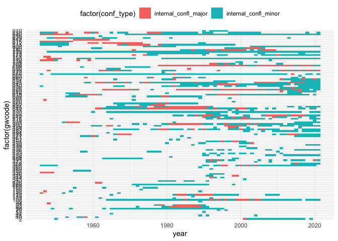
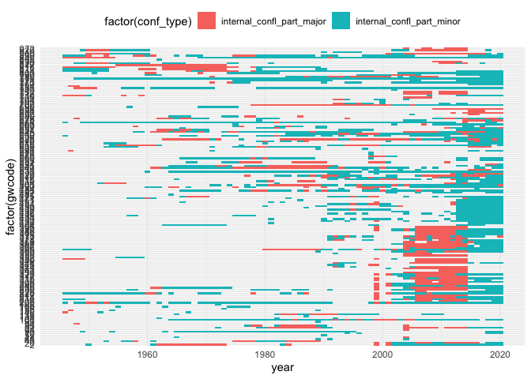
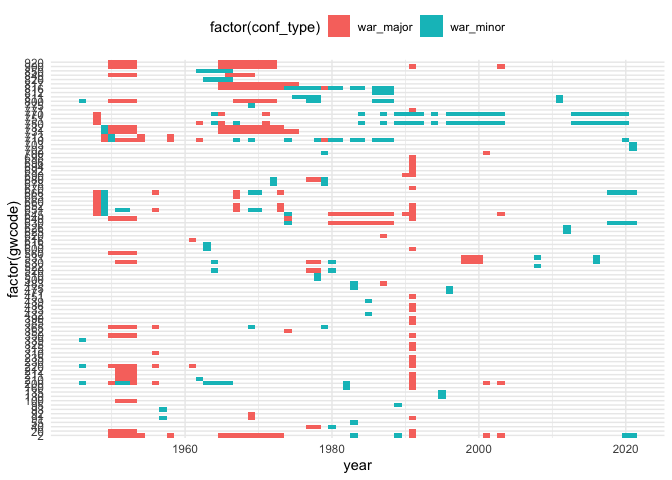
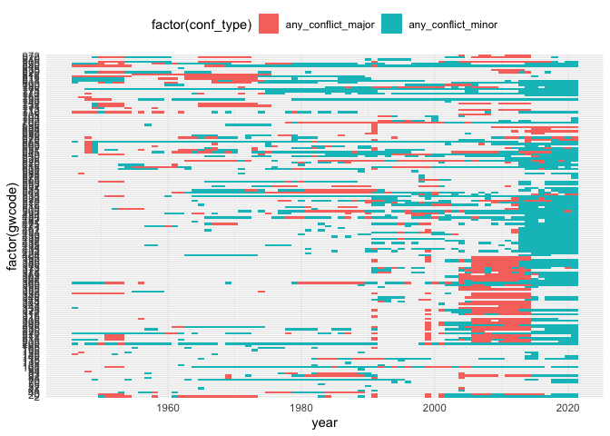
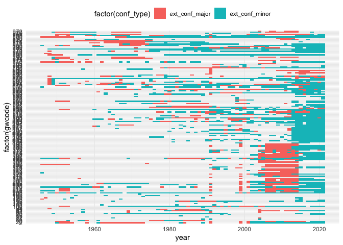

Armed Conflict Dataset (ACD)
================
Author: Andreas Beger

Last updated on: 21 February 2022

``` r
#
#   Clean for format the ACD country-year data
#

suppressPackageStartupMessages({
  library(dplyr)
  library(tidyr)
  library(readxl)
  library(here)
  library(states)
  library(ggplot2)
  library(readr)
})

setwd(here("acd"))

raw <- read_csv("input/v21.1/ucdp-prio-acd-211.csv", col_types = cols())

raw <- raw %>%
  dplyr::mutate_at(vars(dplyr::contains("date")), as.Date)

# Date range:
range(raw$year)
```

    ## [1] 1946 2020

``` r
# The raw data are organized by conflict-year, and lists for each year the
# participants on each side as well as the location(s). Both of those are
# columns where each cell can include multiple values, and where the sets can
# change over time.
#
# The participants can include non-state actors (which won't have a GW code)
raw %>%
  filter(conflict_id==333, year==1987) %>%
  mutate_all(as.character) %>%
  pivot_longer(everything(), values_ptypes = list(character())) %>%
  print(n = 100)
```

    ## # A tibble: 28 × 2
    ##    name                 value                                                               
    ##    <chr>                <chr>                                                               
    ##  1 conflict_id          333                                                                 
    ##  2 location             Afghanistan                                                         
    ##  3 side_a               Government of Afghanistan                                           
    ##  4 side_a_id            130                                                                 
    ##  5 side_a_2nd           Government of Russia (Soviet Union)                                 
    ##  6 side_b               Harakat-i Inqilab-i Islami-yi Afghanistan , Hizb-i Islami-yi Afghan…
    ##  7 side_b_id            293, 299, 294, 297, 295, 292, 296                                   
    ##  8 side_b_2nd           <NA>                                                                
    ##  9 incompatibility      2                                                                   
    ## 10 territory_name       <NA>                                                                
    ## 11 year                 1987                                                                
    ## 12 intensity_level      2                                                                   
    ## 13 cumulative_intensity 1                                                                   
    ## 14 type_of_conflict     4                                                                   
    ## 15 start_date           1975-07-02                                                          
    ## 16 start_prec           2                                                                   
    ## 17 start_date2          1978-04-27                                                          
    ## 18 start_prec2          1                                                                   
    ## 19 ep_end               0                                                                   
    ## 20 ep_end_date          <NA>                                                                
    ## 21 ep_end_prec          <NA>                                                                
    ## 22 gwno_a               700                                                                 
    ## 23 gwno_a_2nd           365                                                                 
    ## 24 gwno_b               <NA>                                                                
    ## 25 gwno_b_2nd           <NA>                                                                
    ## 26 gwno_loc             700                                                                 
    ## 27 region               3                                                                   
    ## 28 version              21.1

``` r
# Here we can see a participant that doesn't have a GW id. ACD does have actor
# IDs in the side_a_id, etc. Also, side_b has multiple actors split with ','.
#
# Takeaways: since i'm turning this into country-year data, i don't care nor
# need (non-state) actor IDs. I can just work with the GW codes.
#
# But, I do want to split cells with multiple GW codes into separate entries
# so i can record a conflict for all those states.
#
# Other variables to note:
#
# - intensity_level:
#   - 1 = Minor (25 to 999 deaths)
#   - 2 = Major (1000+ battle deaths)
#
# - Cumulative intensity: 1 if a conflict has exceeded 1000 battle deaths in a
#   single year.
#
# - Conflict type:
#   - 1 = extrasystemic, colonial wars
#   - 2 = interstate
#   - 3 = internal conflict
#   - 4 = internationalized internal conflict (state + rebels + other states)


# Take out columns we don't need
acd <- raw %>%
  select(conflict_id, location, year, intensity_level, type_of_conflict,
         gwno_a, gwno_a_2nd, gwno_b, gwno_b_2nd, gwno_loc)

# Split multi-participant cells
nrow(acd)
```

    ## [1] 2506

``` r
# v19.1: 2384
# v20.1: 2448
# v21.1: 2506

acd <- acd %>%
  separate_rows(gwno_a, sep = "[, ]+") %>%
  separate_rows(gwno_a_2nd, sep = "[, ]+") %>%
  separate_rows(gwno_b, sep = "[, ]+") %>%
  separate_rows(gwno_b_2nd, sep = "[, ]+") %>%
  separate_rows(gwno_loc, sep = "[, ]+")

nrow(acd)
```

    ## [1] 4803

``` r
# v19.1: 4341
# v20.1: 4546
# v21.1: 4803

# This should not give any warnings about inducing NA's
acd$gwno_a <- as.integer(acd$gwno_a)
acd$gwno_a_2nd <- as.integer(acd$gwno_a_2nd)
acd$gwno_b <- as.integer(acd$gwno_b)
acd$gwno_b_2nd <- as.integer(acd$gwno_b_2nd)
acd$gwno_loc <- as.integer(acd$gwno_loc)
# Throw an error in case of warnigns (which could be from something else too
# though)
if (length(warnings()) > 0) stop("Conversion to integer should not cause NAs")

# Now make this longer, we will have to do this below anyways
acd <-acd %>%
  pivot_longer(starts_with("gwno"), names_to = "role", values_to = "gwcode") %>%
  # some gwcode values are now missing, e.g. if there was no gwno_b_2nd, take
  # those out
  filter(!is.na(gwcode)) %>%
  # this will have duplicate rows because of how we split cells above, take
  # those out
  group_by(conflict_id, location, year, intensity_level, type_of_conflict, role,
           gwcode) %>%
  summarize(.groups = "drop")
nrow(acd)
```

    ## [1] 7635

``` r
# v19.1: 6,977
# v20.1: 7,271
# v21.1: 7,635
# acd is now by participant-conflict-role-year

# Create a template statelist
gw <- state_panel(min(acd$year), max(acd$year), partial = "any", useGW = TRUE)


# Internal conflict on own territory --------------------------------------

intconf <- acd %>%
  filter(type_of_conflict %in% c(1, 3, 4)) %>%
  filter(role=="gwno_loc") %>%
  select(gwcode, year, intensity_level, type_of_conflict)

# Code major/minor war, and summarize to highest level for country-year
intconf <- intconf %>%
  dplyr::mutate(internal_confl = 1,
                internal_confl_major = as.integer(intensity_level==2),
                internal_confl_minor = as.integer(intensity_level==1)) %>%
  dplyr::select(-intensity_level, -type_of_conflict) %>%
  dplyr::group_by(gwcode, year) %>%
  dplyr::summarize_all(list(max))

gw <- dplyr::left_join(gw, intconf, by = c("gwcode", "year")) %>%
  tidyr::replace_na(list(internal_confl = 0, internal_confl_major = 0,
                         internal_confl_minor = 0))

intconf %>%
  pivot_longer(starts_with("internal_confl_"), names_to = "conf_type") %>%
  dplyr::filter(value > 0) %>%
  ggplot(., aes(x = year, y = factor(gwcode), fill = factor(conf_type))) +
  geom_tile() +
  theme_minimal() +
  theme(legend.position = "top")
```

<!-- -->

``` r
# Participant in an internal conflict -------------------------------------
#
#   Own territory or not
#

intconf_part <- acd %>%
  dplyr::filter(type_of_conflict %in% c(1, 3, 4)) %>%
  select(gwcode, year, intensity_level, type_of_conflict) %>%
  arrange(gwcode, year)

# Code major/minor war, and summarize to highest level for country-year
intconf_part <- intconf_part %>%
  dplyr::mutate(internal_confl_part = 1,
                internal_confl_part_major = as.integer(intensity_level==2),
                internal_confl_part_minor = as.integer(intensity_level==1)) %>%
  dplyr::select(-intensity_level, -type_of_conflict) %>%
  dplyr::group_by(gwcode, year) %>%
  dplyr::summarize_all(list(max))

gw <- dplyr::left_join(gw, intconf_part, by = c("gwcode", "year")) %>%
  tidyr::replace_na(list(internal_confl_part = 0, internal_confl_part_major = 0,
                         internal_confl_part_minor = 0))

intconf_part %>%
  pivot_longer(names_to = "conf_type", starts_with("internal_confl_part_")) %>%
  dplyr::filter(value > 0) %>%
  ggplot(., aes(x = year, y = factor(gwcode), fill = factor(conf_type))) +
  geom_tile() +
  theme_minimal() +
  theme(legend.position = "top")
```

<!-- -->

``` r
# Participant in interstate conflict --------------------------------------


war <- acd %>%
  dplyr::filter(type_of_conflict %in% c(2)) %>%
  select(year, intensity_level, gwcode)

# Code major/minor war, and summarize to highest level for country-year
war <- war %>%
  dplyr::mutate(war = 1,
                war_major = as.integer(intensity_level==2),
                war_minor = as.integer(intensity_level==1)) %>%
  dplyr::select(-intensity_level) %>%
  dplyr::group_by(gwcode, year) %>%
  dplyr::summarize_all(list(max))

gw <- dplyr::left_join(gw, war, by = c("gwcode", "year")) %>%
  tidyr::replace_na(list(war = 0, war_major = 0, war_minor = 0))

war %>%
  tidyr::gather(conf_type, value, starts_with("war_")) %>%
  dplyr::filter(value > 0) %>%
  ggplot(., aes(x = year, y = factor(gwcode), fill = factor(conf_type))) +
  geom_tile() +
  theme_minimal() +
  theme(legend.position = "top")
```

<!-- -->

``` r
# Military engaged in any conflict ----------------------------------------


# Any conflict
any_conflict <- acd %>%
  dplyr::select(year, intensity_level, gwcode)

# Code major/minor war, and summarize to highest level for country-year
any_conflict <- any_conflict %>%
  dplyr::mutate(any_conflict = 1,
                any_conflict_major = as.integer(intensity_level==2),
                any_conflict_minor = as.integer(intensity_level==1)) %>%
  dplyr::select(-intensity_level) %>%
  dplyr::group_by(gwcode, year) %>%
  dplyr::summarize_all(list(~max(.)))

gw <- dplyr::left_join(gw, any_conflict, by = c("gwcode", "year")) %>%
  tidyr::replace_na(list(any_conflict = 0, any_conflict_major = 0,
                         any_conflict_minor = 0))

any_conflict %>%
  tidyr::gather(conf_type, value, starts_with("any_conflict_")) %>%
  dplyr::filter(value > 0) %>%
  ggplot(., aes(x = year, y = factor(gwcode), fill = factor(conf_type))) +
  geom_tile() +
  theme_minimal() +
  theme(legend.position = "top")
```

<!-- -->

``` r
# Military engaged in external conflict not on own territory --------------

# External conflict
ext_conf <- acd %>%
  # Involved in conflict, but not conflict location -> external
  dplyr::filter(role != "gwno_loc") %>%
  dplyr::select(year, intensity_level, gwcode) %>%
  dplyr::rename(year = year) %>%
  dplyr::arrange(gwcode, year)

# Code major/minor war, and summarize to highest level for country-year
ext_conf <- ext_conf %>%
  dplyr::mutate(ext_conf = 1,
                ext_conf_major = as.integer(intensity_level==2),
                ext_conf_minor = as.integer(intensity_level==1)) %>%
  dplyr::select(-intensity_level) %>%
  dplyr::group_by(gwcode, year) %>%
  dplyr::summarize_all(list(~max(.)))

gw <- dplyr::left_join(gw, ext_conf, by = c("gwcode", "year")) %>%
  tidyr::replace_na(list(ext_conf = 0, ext_conf_major = 0,
                         ext_conf_minor = 0))

ext_conf %>%
  tidyr::gather(conf_type, value, starts_with("ext_conf_")) %>%
  dplyr::filter(value > 0) %>%
  ggplot(., aes(x = year, y = factor(gwcode), fill = factor(conf_type))) +
  geom_tile() +
  theme_minimal() +
  theme(legend.position = "top")
```

<!-- -->

``` r
codebook <- tibble(
  name = c(
    "gwcode", "year",
    "internal_confl", "internal_confl_major", "internal_confl_minor",
    "internal_confl_part", "internal_confl_part_major", "internal_confl_part_minor",
    "war", "war_major", "war_minor",
    "any_conflict", "any_conflict_major", "any_conflict_minor",
    "ext_conf", "ext_conf_major", "ext_conf_minor"),
  description = c(
    "Gleditsch & Ward country code", "Year",
    rep("Internal conflict (colonial, civil war) on own territory (any level, >1000 deaths, 25-1,000 deaths)", 3),
    rep("Participant in an internal conflict (colonial, civil war), including own territory (any level, >1000 deaths, 25-1,000 deaths)", 3),
    rep("Interstate war (any level, >1000 deaths, 25-1,000 deaths)", 3),
    rep("Participant in any type of conflict (any level, >1000 deaths, 25-1,000 deaths)", 3),
    rep("Participant in any type of conflict, not in own territory (any level, >1000 deaths, 25-1,000 deaths)", 3))
)


# Save --------------------------------------------------------------------

acd <- gw

dim(acd)
```

    ## [1] 11719    17

``` r
table(complete.cases(acd))
```

    ## 
    ##  TRUE 
    ## 11719

``` r
range(acd$year)
```

    ## [1] 1946 2020

``` r
readr::write_rds(acd, "output/acd.rds")
readr::write_csv(acd, "output/acd.csv")

knitr::kable(codebook)
```

| name                      | description                                                                                                                    |
|:--------------------------|:-------------------------------------------------------------------------------------------------------------------------------|
| gwcode                    | Gleditsch & Ward country code                                                                                                  |
| year                      | Year                                                                                                                           |
| internal_confl            | Internal conflict (colonial, civil war) on own territory (any level, \>1000 deaths, 25-1,000 deaths)                           |
| internal_confl_major      | Internal conflict (colonial, civil war) on own territory (any level, \>1000 deaths, 25-1,000 deaths)                           |
| internal_confl_minor      | Internal conflict (colonial, civil war) on own territory (any level, \>1000 deaths, 25-1,000 deaths)                           |
| internal_confl_part       | Participant in an internal conflict (colonial, civil war), including own territory (any level, \>1000 deaths, 25-1,000 deaths) |
| internal_confl_part_major | Participant in an internal conflict (colonial, civil war), including own territory (any level, \>1000 deaths, 25-1,000 deaths) |
| internal_confl_part_minor | Participant in an internal conflict (colonial, civil war), including own territory (any level, \>1000 deaths, 25-1,000 deaths) |
| war                       | Interstate war (any level, \>1000 deaths, 25-1,000 deaths)                                                                     |
| war_major                 | Interstate war (any level, \>1000 deaths, 25-1,000 deaths)                                                                     |
| war_minor                 | Interstate war (any level, \>1000 deaths, 25-1,000 deaths)                                                                     |
| any_conflict              | Participant in any type of conflict (any level, \>1000 deaths, 25-1,000 deaths)                                                |
| any_conflict_major        | Participant in any type of conflict (any level, \>1000 deaths, 25-1,000 deaths)                                                |
| any_conflict_minor        | Participant in any type of conflict (any level, \>1000 deaths, 25-1,000 deaths)                                                |
| ext_conf                  | Participant in any type of conflict, not in own territory (any level, \>1000 deaths, 25-1,000 deaths)                          |
| ext_conf_major            | Participant in any type of conflict, not in own territory (any level, \>1000 deaths, 25-1,000 deaths)                          |
| ext_conf_minor            | Participant in any type of conflict, not in own territory (any level, \>1000 deaths, 25-1,000 deaths)                          |
