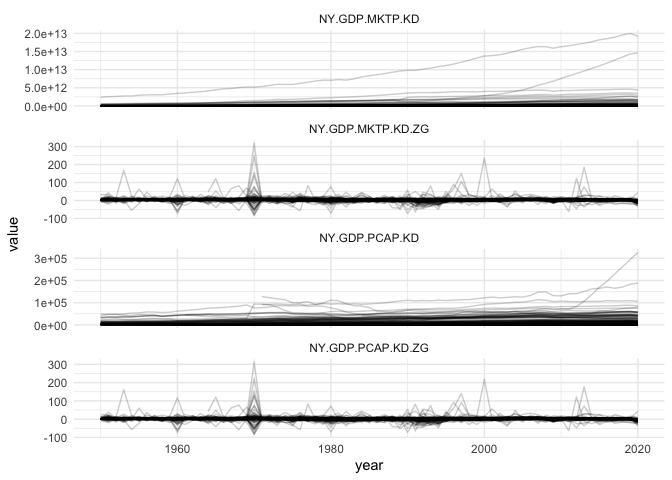

Combined GDP data
================

*Last updated on: 2023-03-23*

GDP data from 1950 on, mostly based on WDI, with some gaps filled with
KSG’s extended GDP data and data from the UN.

Four step imputation procedure:

1.  Acquire the WDI data
2.  Where WDI is missing, drop in UN GDP figures, scaled by a linear
    model.
3.  Where WDI is missing, drop in KSG figures, scaled by a log-linear
    country-varying scaling model.
4.  Model-based extrapolation: use Kalman-smoothing to forward
    extrapolate missing GDP values (most notably Taiwan and several
    countries missing current year GDP values) and backward extrapolate
    GDP growth in first year of existences of a country.

## Overview

``` r
library(dplyr)
```

    ## 
    ## Attaching package: 'dplyr'

    ## The following objects are masked from 'package:stats':
    ## 
    ##     filter, lag

    ## The following objects are masked from 'package:base':
    ## 
    ##     intersect, setdiff, setequal, union

``` r
library(ggplot2)
library(yaml)
library(tidyr)

gdp <- read.csv("output/gdp.csv")
str(gdp)
```

    ## 'data.frame':    11597 obs. of  6 variables:
    ##  $ gwcode           : int  2 20 40 41 42 70 90 91 92 93 ...
    ##  $ year             : int  1950 1950 1950 1950 1950 1950 1950 1950 1950 1950 ...
    ##  $ NY.GDP.MKTP.KD   : num  2.37e+12 1.60e+11 1.65e+10 5.06e+09 2.15e+09 ...
    ##  $ NY.GDP.MKTP.KD.ZG: num  3.868 5.527 0.892 3.109 0 ...
    ##  $ NY.GDP.PCAP.KD   : num  14931 11628 2791 1570 910 ...
    ##  $ NY.GDP.PCAP.KD.ZG: num  0 3.09 0.23 2.16 0 ...

``` r
head(gdp)
```

    ##   gwcode year NY.GDP.MKTP.KD NY.GDP.MKTP.KD.ZG NY.GDP.PCAP.KD NY.GDP.PCAP.KD.ZG
    ## 1      2 1950   2.371053e+12         3.8681393     14930.6888         0.0000000
    ## 2     20 1950   1.596825e+11         5.5270544     11627.6513         3.0871166
    ## 3     40 1950   1.652448e+10         0.8917382      2791.2969         0.2297816
    ## 4     41 1950   5.057760e+09         3.1089622      1570.2453         2.1630856
    ## 5     42 1950   2.152550e+09         0.0000000       910.1691         0.0000000
    ## 6     70 1950   7.545591e+10         6.5071637      2700.1579         3.2440247

``` r
stats <- yaml::read_yaml("output/gdp-signature.yml")
stats
```

    ## $Class
    ## [1] "tbl_df, tbl, data.frame"
    ## 
    ## $Size_in_mem
    ## [1] "0.8 Mb"
    ## 
    ## $N_countries
    ## [1] 204
    ## 
    ## $Years
    ## [1] "1950 - 2021"
    ## 
    ## $N_columns
    ## [1] 6
    ## 
    ## $Columns
    ## [1] "gwcode, year, NY.GDP.MKTP.KD, NY.GDP.MKTP.KD.ZG, NY.GDP.PCAP.KD, NY.GDP.PCAP.KD.ZG"
    ## 
    ## $N_rows
    ## [1] 11597
    ## 
    ## $N_complete_rows
    ## [1] 11565

``` r
gdp %>%
  pivot_longer(-one_of("gwcode", "year")) %>%
  ggplot(., aes(x = year, y = value, group = gwcode)) +
  facet_wrap(~ name, ncol = 1, scales = "free_y") +
  geom_line(alpha = .2) +
  theme_minimal()
```

    ## Warning: Removed 61 rows containing missing values (`geom_line()`).

<!-- -->
