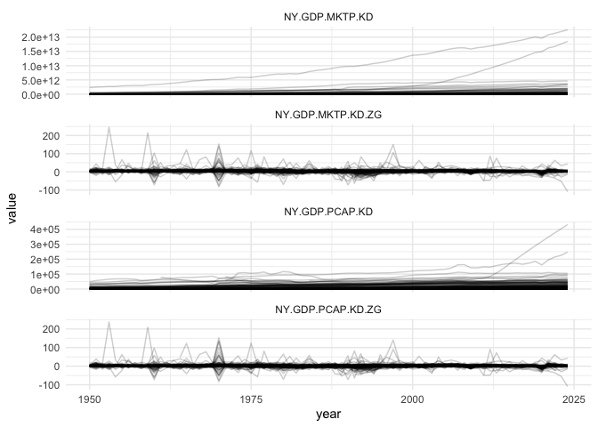

Combined GDP data
================

*Last updated on: 2026-01-13*

GDP data from 1950 on, mostly based on WDI, with some gaps filled with
KSG’s extended GDP data and data from the UN.

Four step imputation procedure:

1.  Acquire the WDI data
2.  Where WDI is missing, drop in UN GDP figures, scaled by a linear
    model.
3.  Where WDI is missing, drop in KSG figures, scaled by a log-linear
    country-varying scaling model.
4.  Model-based extrapolation: use Kalman-smoothing to forward
    extrapolate missing GDP values (most notably Taiwan and several
    countries missing current year GDP values) and backward extrapolate
    GDP growth in first year of existences of a country.

## Overview

``` r
library(dplyr)
```

    ## 
    ## Attaching package: 'dplyr'

    ## The following objects are masked from 'package:stats':
    ## 
    ##     filter, lag

    ## The following objects are masked from 'package:base':
    ## 
    ##     intersect, setdiff, setequal, union

``` r
library(ggplot2)
library(yaml)
library(tidyr)

gdp <- read.csv("output/gdp.csv")
str(gdp)
```

    ## 'data.frame':    12188 obs. of  6 variables:
    ##  $ gwcode           : int  2 20 40 41 42 70 90 91 92 93 ...
    ##  $ year             : int  1950 1950 1950 1950 1950 1950 1950 1950 1950 1950 ...
    ##  $ NY.GDP.MKTP.KD   : num  2.34e+12 1.71e+11 1.66e+10 5.08e+09 2.14e+09 ...
    ##  $ NY.GDP.MKTP.KD.ZG: num  3.84 3.92 0.9 2.81 0 ...
    ##  $ NY.GDP.PCAP.KD   : num  15196 12463 2801 1555 898 ...
    ##  $ NY.GDP.PCAP.KD.ZG: num  0 1.518 0.299 2.312 0 ...

``` r
head(gdp)
```

    ##   gwcode year NY.GDP.MKTP.KD NY.GDP.MKTP.KD.ZG NY.GDP.PCAP.KD NY.GDP.PCAP.KD.ZG
    ## 1      2 1950   2.343209e+12         3.8447774     15195.6436         0.0000000
    ## 2     20 1950   1.712624e+11         3.9190086     12462.9252         1.5181253
    ## 3     40 1950   1.659334e+10         0.8999262      2800.7951         0.2988148
    ## 4     41 1950   5.079304e+09         2.8095748      1555.3456         2.3119846
    ## 5     42 1950   2.136579e+09         0.0000000       897.7624         0.0000000
    ## 6     70 1950   8.187418e+10         6.4484984      2967.7528         3.7185531

``` r
stats <- yaml::read_yaml("output/gdp-signature.yml")
stats
```

    ## $Class
    ## [1] "tbl_df, tbl, data.frame"
    ## 
    ## $Size_in_mem
    ## [1] "1.3 Mb"
    ## 
    ## $N_countries
    ## [1] 204
    ## 
    ## $Years
    ## [1] "1950 - 2024"
    ## 
    ## $N_columns
    ## [1] 6
    ## 
    ## $Columns
    ## [1] "gwcode, year, NY.GDP.MKTP.KD, NY.GDP.MKTP.KD.ZG, NY.GDP.PCAP.KD, NY.GDP.PCAP.KD.ZG"
    ## 
    ## $N_rows
    ## [1] 12188
    ## 
    ## $N_complete_rows
    ## [1] 12150

``` r
gdp %>%
  pivot_longer(-one_of("gwcode", "year")) %>%
  ggplot(., aes(x = year, y = value, group = gwcode)) +
  facet_wrap(~ name, ncol = 1, scales = "free_y") +
  geom_line(alpha = .2) +
  theme_minimal()
```

    ## Warning: Removed 73 rows containing missing values or values outside the scale range
    ## (`geom_line()`).

<!-- -->
