GDP
================
Author: Andreas Beger

Last updated on: 23 March 2023

This file is generated from clean-gdp.R. To spint/knit/compile the .md
file, run:  
`setwd("gdp"); rmarkdown::render("clean-gdp.R")`

For updating the data, all items requiring attention are marked with
“UPDATE:”.

UPDATE: This script uses `population.csv` as an input for calculating
GDP per capita. Drop in an updated version from `population/` if needed.

The WDI GDP data, cached in the input folder, also need to be updated.
Delete `input/wdigdp.csv` for that to happen automatically (or see the
UPDATE: below).

The other inputs (KSG and UN GDP) only concern historical data so they
should not need to be updated.

``` r
suppressPackageStartupMessages({
  library(tidyverse)
  library(WDI)
  library(states)
  library(lubridate)
  library(countrycode)
  library(lme4)
  library(imputeTS)
  library(here)
})

oldwd <- getwd()
setwd(here::here("gdp"))


# Functions ---------------------------------------------------------------

gdp_wdi_add_gwcode <- function(x) {
  starty <- min(x$year)
  endy <- max(x$year)
  cy <- states::state_panel(starty, endy, partial = "any", useGW = TRUE)

  x <- x %>%
    mutate(gwcode = countrycode::countrycode(x$iso2c, "iso2c", "cown", warn = FALSE),
           gwcode = as.integer(gwcode)) %>%
    mutate(gwcode = case_when(
      iso2c=="RS" ~ 340L,
      iso2c=="XK" ~ 347L,

      gwcode==255 ~ 260L,
      gwcode==679 ~ 678L,

      gwcode==970 ~ 971L,
      gwcode==946 ~ 970L,
      gwcode==947 ~ 973L,
      gwcode==955 ~ 972L,
      TRUE ~ gwcode
    ))

  # drop countries that unify
  x <- x %>%
    filter(!(gwcode==260 & year < 1990)) %>%
    filter(!(gwcode==678 & year < 1990))

  x <- dplyr::select(x, -iso2c, -country)
  x <- x %>% filter(!is.na(gwcode))

  cy <- dplyr::left_join(cy, x, by = c("gwcode", "year"))
  cy
}

gdp_un_add_gwcode <- function(x) {
  starty <- min(x$year)
  endy <- max(x$year)
  cy <- states::state_panel(starty, endy, partial = "any", useGW = TRUE)

  x <- x %>%
    mutate(cowcode = countrycode(country_name, "country.name", "cown", warn = FALSE),
           cowcode = as.integer(cowcode))

  x <- x %>%
    mutate(gwcode = case_when(
      country_name=="Democratic Republic of Vietnam" ~ 816L,
      # UN seems to have correct series for Yugo/Serbia
      country_name=="Serbia" & year > 2006 ~ 340L,
      country_name=="Serbia" & year <= 2006 ~ 345L,
      # need to add 2006 for Serbia
      cowcode==255 ~ 260L,
      cowcode==679 ~ 678L,
      cowcode==955 ~ 972L,
      # Czechoslovakia/CR also treated correctly, and they had a nice split date
      cowcode==316 & year < 1993 ~ 315L,
      TRUE ~ cowcode
    ))
  serbia2006 <- x[x$country_name=="Serbia" & x$year==2006, ]
  serbia2006$gwcode <- 340L

  x <- bind_rows(x, serbia2006) %>%
    arrange(gwcode, year)

  # drop countries that unify, historic GDP values are incorrect
  x <- x %>%
    filter(!(gwcode==260 & year < 1990)) %>%
    filter(!(gwcode==678 & year < 1990)) %>%
    filter(!(gwcode==816 & year < 1975))

  in_un_not_in_master <- anti_join(x, cy, by = c("year", "gwcode")) %>%
    group_by(country_name) %>%
    summarize(gwcode = unique(gwcode)[1], year = paste0(range(year), collapse = " - "))

  in_master_not_in_un <- anti_join(cy, x, by = c("gwcode", "year")) %>%
    group_by(gwcode) %>%
    summarize(year = paste0(range(year), collapse = " - "))

  x <- dplyr::select(x, -country_name, -country_id, -cowcode)
  x <- x %>% filter(!is.na(gwcode))

  cy <- dplyr::left_join(cy, x, by = c("gwcode", "year"))
  cy
}

# Check whether the mtime of a file is from last year (i.e. forgot to update)
check_mtime <- function(x) {
  myear <- substr(as.Date(file.info(x)['mtime'][[1]]), 1, 4)
  if (myear < substr(Sys.Date(), 1, 4)) {
    warning(sprintf("'%s' is from last year, forgot to drop in an update?", x))
  }
  invisible(myear)
}

load_inputs <- function() {
  # don't want column specification messages
  suppressMessages({
    check_mtime("input/wdigdp.csv")
    wdigdp <- read.csv("input/wdigdp.csv")[, c("iso2c", "country", "year", "NY.GDP.MKTP.KD")]
    
    ksggdp <- read_delim("input/expgdpv6.0/gdpv6.txt", delim = "\t") %>%
      rename(gwcode = statenum) %>%
      select(-stateid)

    ungdp <- read_csv("input/UNgdpData.csv") %>%
      select(country_name, country_id, year, gdp_2010USD)
    
    check_mtime("input/population.csv")
    pop <- read_csv("input/population.csv")
  })

  list(wdigdp = wdigdp, ksggdp = ksggdp, ungdp = ungdp, pop = pop)
}

# This is a top-level function for cleaning the GDP data
# impute: TRUE/FALSE impute missing series values?
# inputs: a 3-item list with WDI GDP data, KSG GDP, UN GDP, and pop data
#         (names: c("wdigdp", "ksggdp", "ungdp", "pop"))
gdp_get_yearly <- function(impute, inputs = load_inputs()) {

  wdigdp <- inputs$wdigdp
  ksggdp <- inputs$ksggdp
  ungdp  <- inputs$ungdp
  pop <- inputs$pop

  # if the latest year (or any others) are completely missing, drop them
  dropyear <- wdigdp %>%
    group_by(year) %>%
    summarize(missing = sum(is.na(NY.GDP.MKTP.KD))==n(),
              .groups = "drop") %>%
    filter(missing) %>%
    pull(year)
  if (length(dropyear) > 0) {
    cat("Year(s) ", paste0(dropyear, collapse = ", "), "are complete missing, droping\n")
    wdigdp <- wdigdp %>%
      filter(!year %in% dropyear)
  }
  
  # add standard country codes
  wdi <- gdp_wdi_add_gwcode(wdigdp)
  ungdp <- gdp_un_add_gwcode(ungdp)

  # Combine
  joint <- wdi %>%
    full_join(., ksggdp, by = c("gwcode", "year")) %>%
    select(-pop, -rgdppc, -cgdppc) %>%
    mutate(realgdp = realgdp*1e6) %>%
    full_join(., ungdp, by = c("gwcode", "year")) %>%
    arrange(gwcode, year)

  mdl_un <- lm(NY.GDP.MKTP.KD ~ -1 + gdp_2010USD, data = joint)
  joint <- joint %>%
    mutate(un_gdp.rescaled = predict(mdl_un, newdata = joint))

  mdl_ksg <- lmer(log(NY.GDP.MKTP.KD) ~ -1 + log(realgdp) + (log(realgdp)|gwcode), data = joint)
  joint <- joint %>%
    mutate(ksg_gdp.rescaled = exp(predict(mdl_ksg, newdata = joint, allow.new.levels = TRUE)))

  joint <- joint %>%
    mutate(NY.GDP.MKTP.KD = case_when(
      # special treatment for Qatar 1971, where otherwise a big jump occurs
      gwcode==694 & year==1971 ~ filter(joint, gwcode==694) %>% 
        pull(un_gdp.rescaled) %>% rev() %>% imputeTS::na_kalman() %>% tail(1),
      is.na(NY.GDP.MKTP.KD) & !is.na(un_gdp.rescaled) ~ un_gdp.rescaled,
      is.na(NY.GDP.MKTP.KD) & !is.na(ksg_gdp.rescaled) ~ ksg_gdp.rescaled,
      TRUE ~ NY.GDP.MKTP.KD
    ))

  joint <- joint %>%
    # take out components; don't need anymore
    select(gwcode, year, NY.GDP.MKTP.KD) %>%
    # add GDP growth
    arrange(gwcode, year) %>%
    group_by(gwcode) %>%
    mutate(
      NY.GDP.MKTP.KD.ZG = (NY.GDP.MKTP.KD - lag(NY.GDP.MKTP.KD)) / 
        lag(NY.GDP.MKTP.KD) * 100) %>%
    ungroup()

  if (impute) {
    # forward and backward impute GDP
    joint <- joint %>%
      group_by(gwcode) %>%
      mutate(NY.GDP.MKTP.KD = imputeTS::na_kalman(NY.GDP.MKTP.KD)) %>%
      ungroup()
    joint <- joint %>%
      group_by(gwcode) %>%
      arrange(desc(year)) %>%
      mutate(NY.GDP.MKTP.KD = imputeTS::na_kalman(NY.GDP.MKTP.KD)) %>%
      ungroup()

    # update GDP change calculation; use backward impute for first year
    joint <- joint %>%
      group_by(gwcode) %>%
      arrange(year) %>%
      mutate(NY.GDP.MKTP.KD.ZG = (NY.GDP.MKTP.KD - lag(NY.GDP.MKTP.KD)) / lag(NY.GDP.MKTP.KD) * 100) %>%
      arrange(desc(year)) %>%
      mutate(NY.GDP.MKTP.KD.ZG = tryCatch({
        suppressWarnings(imputeTS::na_kalman(NY.GDP.MKTP.KD.ZG, model = "auto.arima"))
      }, error = function(e) NY.GDP.MKTP.KD.ZG)) %>%
      arrange(year) %>%
      ungroup()
  }

  # Add GDP per capita
  joint <- joint %>%
    left_join(pop, by = c("gwcode", "year")) %>%
    group_by(gwcode) %>%
    arrange(year) %>%
    mutate(NY.GDP.PCAP.KD = NY.GDP.MKTP.KD / (pop*1e3),
           NY.GDP.PCAP.KD.ZG = (NY.GDP.PCAP.KD - lag(NY.GDP.PCAP.KD)) / lag(NY.GDP.PCAP.KD) * 100) %>%
    select(-pop) %>%
    # backwards impute first year of GDP per capita change
    group_by(gwcode) %>%
    arrange(desc(year)) %>%
    mutate(NY.GDP.PCAP.KD.ZG = tryCatch({
      suppressWarnings(imputeTS::na_kalman(NY.GDP.PCAP.KD.ZG, model = "auto.arima"))
    }, error = function(e) NY.GDP.PCAP.KD.ZG)) %>%
    arrange(year) %>%
    ungroup()

  joint$year <- as.integer(joint$year)

  joint
}


# Load/clean inputs -------------------------------------------------------
```

## WDI GDP data

Relevant WDI indicators:

- “NY.GDP.PCAP.PP.KD.ZG”
- “NY.GDP.PCAP.PP.KD”
- “NY.GDP.PCAP.KD.ZG”
- “NY.GDP.PCAP.KD”
- “NY.GDP.MKTP.PP.CD”: GDP per capita (constant 2011 international \$)
- “NY.GDP.MKTP.PP.KD”: GDP per capita (constant 2020 US\$)
- “NY.GDP.MKTP.KD”: GDP (constant 2010 US\$)
- “NY.GDP.MKTP.KD.ZG”: GDP growth
- “SP.POP.TOTL”

UPDATE: delete `input/wdigdp.csv` and run the chunk below to re-download
and cache the latest WDI GDP data.

``` r
if (!file.exists("input/wdigdp.csv")) {
  # UPDATE: end year
  wdi1 <- WDI(country = "all", start = 1960, end = 2023,
              indicator = c("NY.GDP.MKTP.PP.KD"))
  wdi2 <- WDI(country = "all", start = 1960, end = 2023,
              indicator = c("NY.GDP.MKTP.PP.CD"))
  wdi3 <- WDI(country = "all", start = 1960, end = 2023,
              indicator = c("NY.GDP.MKTP.KD"))
  wdigdp <- Reduce(left_join, list(wdi1, wdi2, wdi3))
  write.csv(wdigdp, file = "input/wdigdp.csv", row.names = FALSE)
}

wdigdp <- read.csv("input/wdigdp.csv")


wdi <- gdp_wdi_add_gwcode(wdigdp)

plot_missing(wdi, "NY.GDP.MKTP.KD", "gwcode", time = "year", 
             statelist = "GW") +
  ggtitle("NY.GDP.MKTP.KD")
```

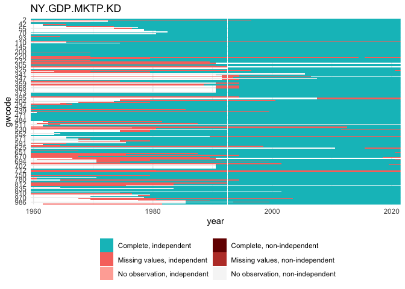<!-- -->

``` r
plot_missing(wdi, "NY.GDP.MKTP.PP.KD", "gwcode",  time =  "year", 
             statelist = "GW") +
  ggtitle("NY.GDP.MKTP.PP.KD")
```

<!-- -->

``` r
plot_missing(wdi, "NY.GDP.MKTP.PP.CD", "gwcode",  time =  "year", 
             statelist = "GW") +
  ggtitle("NY.GDP.MKTP.PP.CD")
```

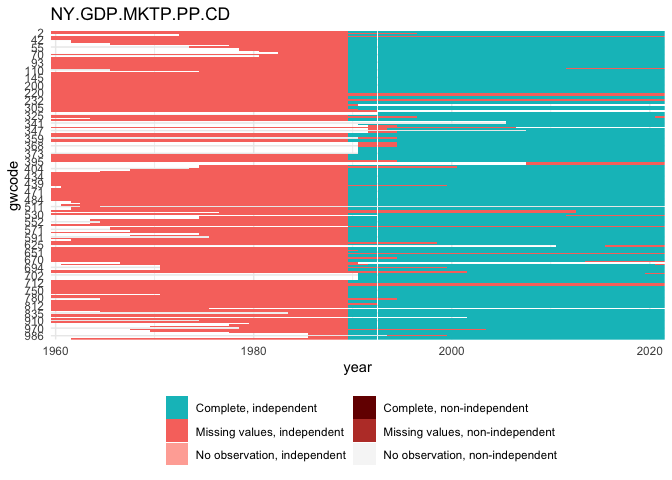<!-- -->

## KSG expanded GDP

``` r
ksggdp <- read_delim("input/expgdpv6.0/gdpv6.txt", delim = "\t") %>%
  rename(gwcode = statenum) %>%
  select(-stateid)
```

    ## Rows: 9627 Columns: 8
    ## ── Column specification ────────────────────────────────────────────────────────────────
    ## Delimiter: "\t"
    ## chr (1): stateid
    ## dbl (7): statenum, year, pop, realgdp, rgdppc, cgdppc, origin
    ## 
    ## ℹ Use `spec()` to retrieve the full column specification for this data.
    ## ℹ Specify the column types or set `show_col_types = FALSE` to quiet this message.

``` r
plot_missing(ksggdp, "realgdp", "gwcode", time = "year", statelist = "GW")
```

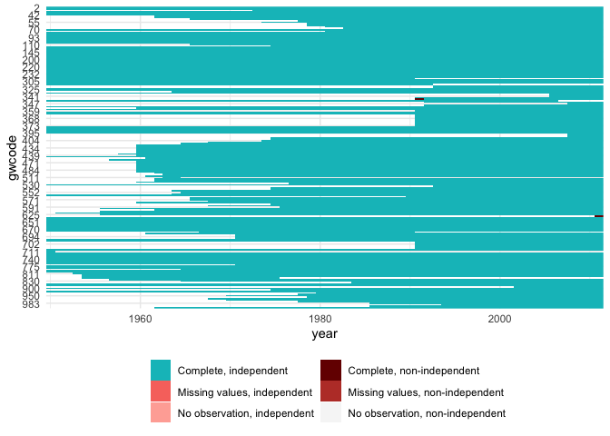<!-- -->

## UN GDP data

``` r
ungdp <- read_csv("input/UNgdpData.csv") %>%
  select(country_name, country_id, year, gdp_2010USD) 
```

    ## Rows: 8272 Columns: 7
    ## ── Column specification ────────────────────────────────────────────────────────────────
    ## Delimiter: ","
    ## chr (1): country_name
    ## dbl (6): country_id, year, gdp_2010USD, gdp_2010USD_log, gdp_2010USD_lagged, gdp_201...
    ## 
    ## ℹ Use `spec()` to retrieve the full column specification for this data.
    ## ℹ Specify the column types or set `show_col_types = FALSE` to quiet this message.

``` r
ungdp <- gdp_un_add_gwcode(ungdp)  
plot_missing(ungdp, "gdp_2010USD", "gwcode", time = "year", statelist = "GW")
```

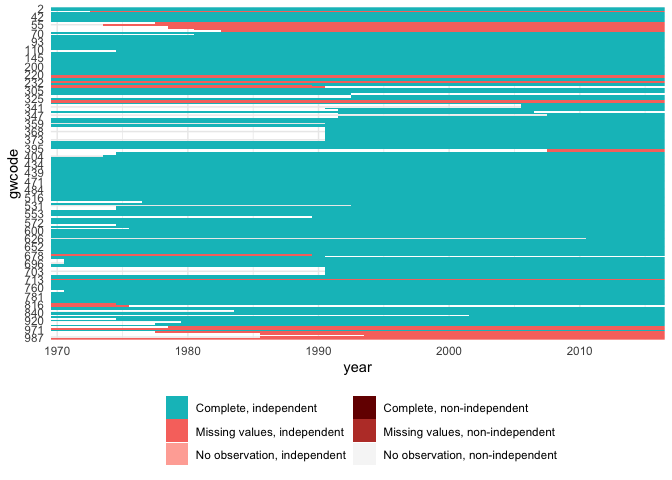<!-- -->

``` r
# Combine data ------------------------------------------------------------
```

## Combine data

``` r
joint <- wdi %>%
  select(-iso3c) %>%
  full_join(., ksggdp, by = c("gwcode", "year")) %>%
  select(-pop, -rgdppc, -cgdppc) %>%
  mutate(realgdp = realgdp*1e6) %>%
  full_join(., ungdp, by = c("gwcode", "year")) 
  

# Example countries to look at below
countries <- unique(c(
  c(2, 200, 220, 260, 290, 315, 740, 710),
  sample(unique(joint$gwcode), 4)))
```

## Overlap between UN and WDI

The UN GDP data is almost completely correlated with WDI GDP.

``` r
# the UN GDP is almost completely correlated with WDI GDP
sum(complete.cases(joint[, c("gdp_2010USD", "NY.GDP.MKTP.KD")]))
```

    ## [1] 6592

``` r
cor(joint$gdp_2010USD, joint$NY.GDP.MKTP.KD, use = "complete.obs")
```

    ## [1] 0.9911905

``` r
plot(log10(joint$gdp_2010USD), log10(joint$NY.GDP.MKTP.KD))
```

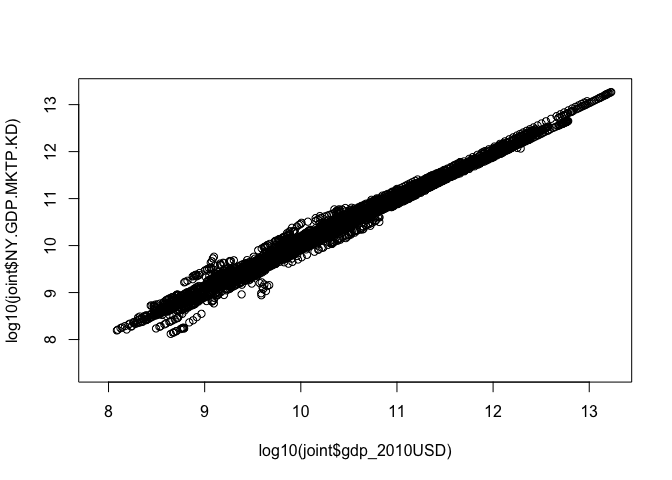<!-- -->

Does it add any non-missing values? Yes, about 800 or so.

``` r
# does it add any non-missing values?
joint %>%
  mutate(un_gdp_missing = is.na(gdp_2010USD),
         wdi_gdp_missing = is.na(NY.GDP.MKTP.KD)) %>%
  group_by(un_gdp_missing, wdi_gdp_missing) %>%
  summarize(n = n())
```

    ## `summarise()` has grouped output by 'un_gdp_missing'. You can override using the
    ## `.groups` argument.

    ## # A tibble: 4 × 3
    ## # Groups:   un_gdp_missing [2]
    ##   un_gdp_missing wdi_gdp_missing     n
    ##   <lgl>          <lgl>           <int>
    ## 1 FALSE          FALSE            6592
    ## 2 FALSE          TRUE              917
    ## 3 TRUE           FALSE            2338
    ## 4 TRUE           TRUE             1750

For which countries? Somalia, Syria, …

``` r
# which countries?
adds <- joint %>% 
  filter(is.na(NY.GDP.MKTP.KD) & !is.na(gdp_2010USD)) %>%
  group_by(gwcode) %>%
  summarize(adds = n())
head(arrange(adds, desc(adds)))
```

    ## # A tibble: 6 × 2
    ##   gwcode  adds
    ##    <dbl> <int>
    ## 1    101    47
    ## 2    731    47
    ## 3    520    43
    ## 4    345    37
    ## 5    522    36
    ## 6    700    32

``` r
# look at some examples of those
set.seed(1343)
countries2 <- unique(c(c(290, 345), 
                       sample(adds$gwcode, 8)))

mdl <- lm(NY.GDP.MKTP.KD ~ -1 + gdp_2010USD, data = joint)
joint <- joint %>%
  mutate(gdp_2010USD.rescaled = predict(mdl, newdata = joint))
joint %>%
  gather(var, value, -gwcode, -year, -origin, -realgdp, -NY.GDP.MKTP.PP.KD, -gdp_2010USD) %>%
  filter(gwcode %in% countries2) %>%
  ggplot(aes(x = year, y = value, colour = var, group = interaction(gwcode, var))) +
  geom_line(alpha = .5) +
  facet_wrap(~ gwcode, scales = "free_y")
```

    ## Warning: attributes are not identical across measure variables;
    ## they will be dropped

    ## Warning: Removed 862 rows containing missing values (`geom_line()`).

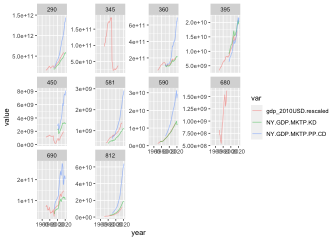<!-- -->

``` r
joint %>%
  gather(var, value, -gwcode, -year, -origin, -NY.GDP.MKTP.PP.KD, -gdp_2010USD) %>%
  filter(gwcode %in% countries) %>%
  ggplot(aes(x = year, y = value, colour = var, group = interaction(gwcode, var))) +
  geom_line(alpha = .5) +
  facet_wrap(~ gwcode, scales = "free_y")
```

    ## Warning: attributes are not identical across measure variables;
    ## they will be dropped

    ## Warning: Removed 968 rows containing missing values (`geom_line()`).

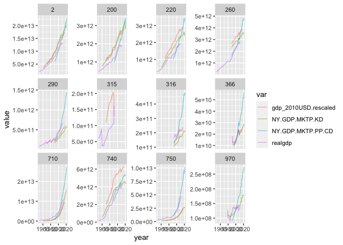<!-- -->

Rescaled UN GDP matches WDI very well, it seems. Adjusted R^2 is
basically 1 and so is the coefficient.

### Overlap between KSG expanded and WDI

``` r
sum(complete.cases(joint[, c("realgdp", "NY.GDP.MKTP.PP.KD")]))
```

    ## [1] 3758

``` r
cor(joint$realgdp, joint$NY.GDP.MKTP.PP.KD, use = "complete.obs")
```

    ## [1] 0.9932796

``` r
sum(complete.cases(joint[, c("realgdp", "NY.GDP.MKTP.KD")]))
```

    ## [1] 7055

``` r
cor(joint$realgdp, joint$NY.GDP.MKTP.KD, use = "complete.obs")
```

    ## [1] 0.9697244

Plain linear rescaling doesn’t work well.

``` r
mdl <- lm(NY.GDP.MKTP.KD ~ -1 + realgdp, data = joint)
summary(mdl)
```

    ## 
    ## Call:
    ## lm(formula = NY.GDP.MKTP.KD ~ -1 + realgdp, data = joint)
    ## 
    ## Residuals:
    ##        Min         1Q     Median         3Q        Max 
    ## -3.542e+12 -1.520e+10 -2.111e+09  4.796e+08  2.304e+12 
    ## 
    ## Coefficients:
    ##         Estimate Std. Error t value Pr(>|t|)    
    ## realgdp 1.089638   0.003191   341.5   <2e-16 ***
    ## ---
    ## Signif. codes:  0 '***' 0.001 '**' 0.01 '*' 0.05 '.' 0.1 ' ' 1
    ## 
    ## Residual standard error: 2.389e+11 on 7054 degrees of freedom
    ##   (4542 observations deleted due to missingness)
    ## Multiple R-squared:  0.943,  Adjusted R-squared:  0.943 
    ## F-statistic: 1.166e+05 on 1 and 7054 DF,  p-value: < 2.2e-16

``` r
joint <- joint %>%
  mutate(realgdp.rescaled = predict(mdl, newdata = joint))
joint %>%
  gather(var, value, -gwcode, -year, -origin, -NY.GDP.MKTP.PP.KD, -starts_with("gdp_2010")) %>%
  filter(gwcode %in% countries) %>%
  ggplot(aes(x = year, y = value, colour = var, group = interaction(gwcode, var))) +
  geom_line(alpha = .5) +
  facet_wrap(~ gwcode, scales = "free_y")
```

    ## Warning: attributes are not identical across measure variables;
    ## they will be dropped

    ## Warning: Removed 785 rows containing missing values (`geom_line()`).

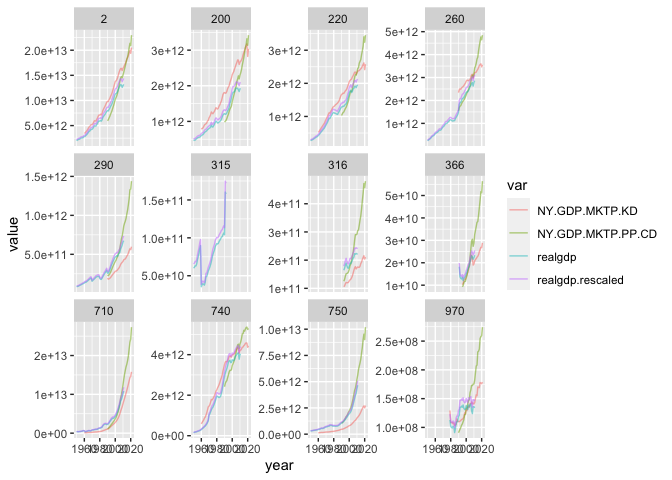<!-- -->

``` r
plot(log10(joint$realgdp), log10(joint$NY.GDP.MKTP.KD))
```

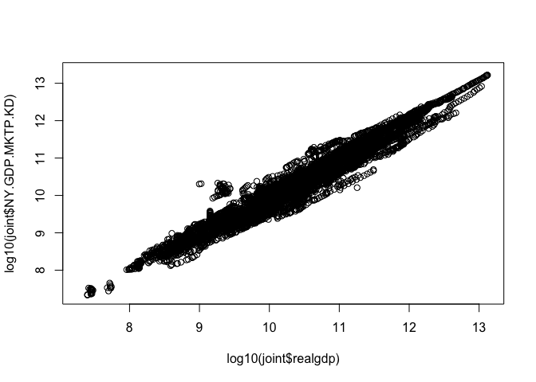<!-- -->

``` r
plot(log10(joint$realgdp.rescaled), log10(joint$NY.GDP.MKTP.KD))
```

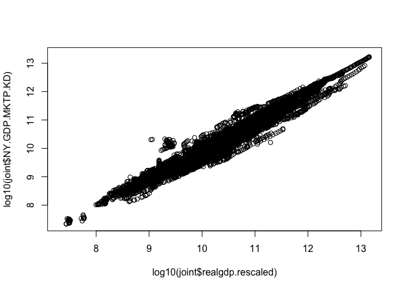<!-- -->

Try log model, also doesn’t work super well.

``` r
mdl <- lm(log(NY.GDP.MKTP.KD) ~ -1 + log(realgdp), data = joint)
summary(mdl)
```

    ## 
    ## Call:
    ## lm(formula = log(NY.GDP.MKTP.KD) ~ -1 + log(realgdp), data = joint)
    ## 
    ## Residuals:
    ##     Min      1Q  Median      3Q     Max 
    ## -2.1946 -0.3192 -0.0087  0.3801  3.1848 
    ## 
    ## Coefficients:
    ##               Estimate Std. Error t value Pr(>|t|)    
    ## log(realgdp) 0.9916292  0.0002631    3769   <2e-16 ***
    ## ---
    ## Signif. codes:  0 '***' 0.001 '**' 0.01 '*' 0.05 '.' 0.1 ' ' 1
    ## 
    ## Residual standard error: 0.5294 on 7054 degrees of freedom
    ##   (4542 observations deleted due to missingness)
    ## Multiple R-squared:  0.9995, Adjusted R-squared:  0.9995 
    ## F-statistic: 1.421e+07 on 1 and 7054 DF,  p-value: < 2.2e-16

``` r
joint <- joint %>%
  mutate(realgdp.rescaled2 = exp(predict(mdl, newdata = joint)))
joint %>%
  gather(var, value, -gwcode, -year, -origin, -NY.GDP.MKTP.PP.KD, -starts_with("gdp_2010")) %>%
  filter(gwcode %in% countries) %>%
  ggplot(aes(x = year, y = value, colour = var, group = interaction(gwcode, var))) +
  geom_line() +
  facet_wrap(~ gwcode, scales = "free_y")
```

    ## Warning: attributes are not identical across measure variables;
    ## they will be dropped

    ## Warning: Removed 895 rows containing missing values (`geom_line()`).

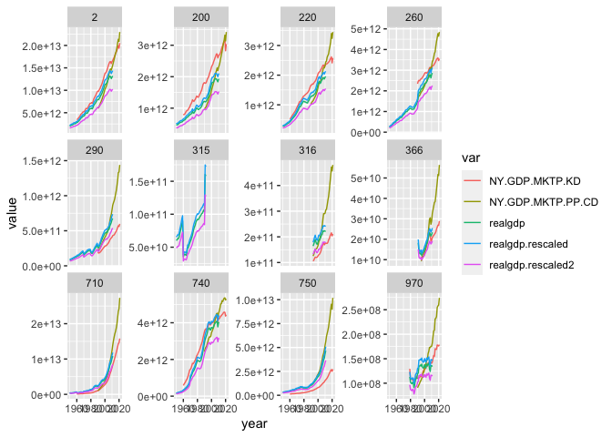<!-- -->

``` r
plot(log10(joint$realgdp), log10(joint$NY.GDP.MKTP.KD))
abline(a = 0, b = 1)
```

<!-- -->

``` r
plot(log10(joint$realgdp.rescaled2), log10(joint$NY.GDP.MKTP.KD))
abline(a = 0, b = 1)
```

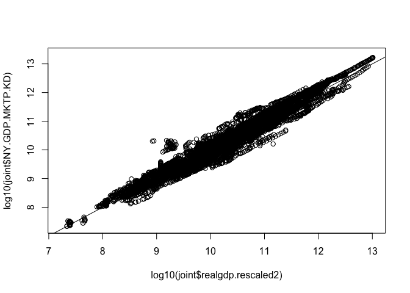<!-- -->

Try scaling by country:

``` r
# try country-varying scaling factors; this works fairly well
library("lme4")
mdl <- lmer(log(NY.GDP.MKTP.KD) ~ -1 + log(realgdp) + (log(realgdp)|gwcode), data = joint)
```

    ## Warning in checkConv(attr(opt, "derivs"), opt$par, ctrl = control$checkConv, : Model
    ## failed to converge with max|grad| = 0.00655919 (tol = 0.002, component 1)

``` r
joint <- joint %>%
  mutate(realgdp.rescaled3 = exp(predict(mdl, newdata = joint, allow.new.levels = TRUE)))
joint %>%
  gather(var, value, -gwcode, -year, -origin, -realgdp.rescaled, -realgdp.rescaled2,
         -starts_with("gdp_2010"), -NY.GDP.MKTP.PP.KD) %>%
  filter(gwcode %in% countries) %>%
  ggplot(aes(x = year, y = value, colour = var, group = interaction(gwcode, var))) +
  geom_line() +
  facet_wrap(~ gwcode, scales = "free_y")
```

    ## Warning: attributes are not identical across measure variables;
    ## they will be dropped

    ## Warning: Removed 785 rows containing missing values (`geom_line()`).

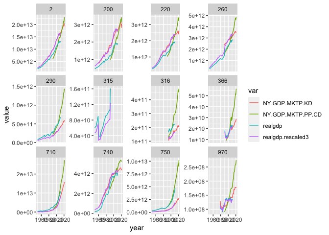<!-- -->

``` r
plot(log10(joint$realgdp), log10(joint$NY.GDP.MKTP.KD))
abline(a = 0, b = 1)
```

<!-- -->

``` r
plot(log10(joint$realgdp.rescaled3), log10(joint$NY.GDP.MKTP.KD))
abline(a = 0, b = 1)
```

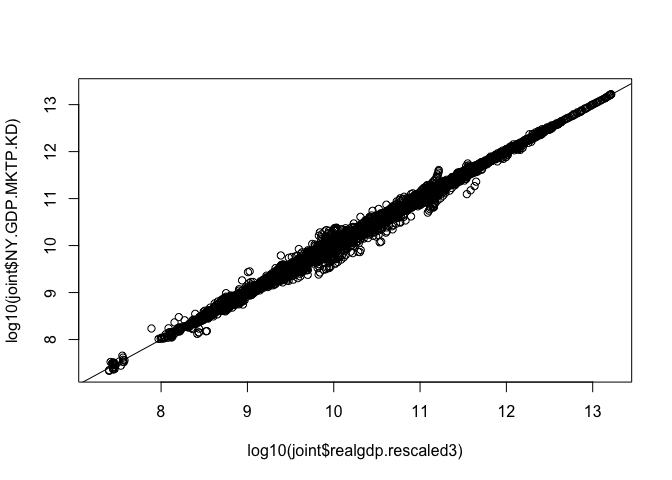<!-- -->

### Joint model of UN and KSG predicting WDI

``` r
mdl_combo <- lmer(log(NY.GDP.MKTP.KD) ~ -1 + log(gdp_2010USD) + log(realgdp) + (log(realgdp)|gwcode), data = joint)
```

    ## Warning in checkConv(attr(opt, "derivs"), opt$par, ctrl = control$checkConv, : Model
    ## failed to converge with max|grad| = 0.00352668 (tol = 0.002, component 1)

``` r
joint <- joint %>%
  mutate(NY.GDP.MKTP.KD.hat = exp(predict(mdl_combo, newdata = joint, allow.new.levels = TRUE)))
joint %>%
  gather(var, value, -gwcode, -year, -origin, -realgdp, -realgdp.rescaled, -realgdp.rescaled2, -realgdp.rescaled3,
         -starts_with("gdp_2010"), -NY.GDP.MKTP.PP.KD) %>%
  filter(gwcode %in% countries) %>%
  ggplot(aes(x = year, y = value, colour = var, group = interaction(gwcode, var))) +
  geom_line() +
  facet_wrap(~ gwcode, scales = "free_y")
```

    ## Warning: attributes are not identical across measure variables;
    ## they will be dropped

    ## Warning: Removed 908 rows containing missing values (`geom_line()`).

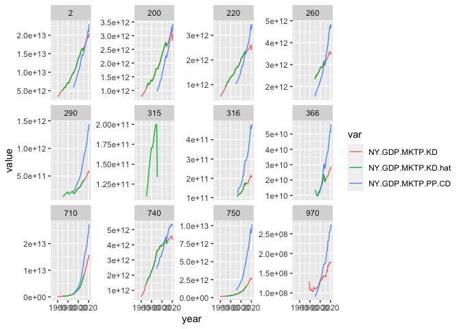<!-- -->

``` r
joint %>%
  gather(var, value, -gwcode, -year, -origin, -realgdp, -realgdp.rescaled, -realgdp.rescaled2, -realgdp.rescaled3,
         -starts_with("gdp_2010"), -NY.GDP.MKTP.PP.KD) %>%
  filter(gwcode %in% countries2) %>%
  ggplot(aes(x = year, y = value, colour = var, group = interaction(gwcode, var))) +
  geom_line() +
  facet_wrap(~ gwcode, scales = "free_y")
```

    ## Warning: attributes are not identical across measure variables;
    ## they will be dropped

    ## Warning: Removed 902 rows containing missing values (`geom_line()`).

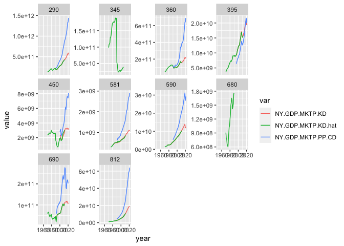<!-- -->

This works well, but cannot predict when either KSG or UN is missing, so
not useful in practice for filling in WDI gaps.

### Conclusion

Four step imputation procedure:

1.  Acquire the WDI data
2.  Where WDI is missing, drop in UN GDP figures, scaled by a linear
    model.
3.  Where WDI is missing, drop in KSG figures, scaled by a log-linear
    country-varying scaling model.
4.  Model-based extrapolation: use Kalman-smoothing to forward
    extrapolate missing GDP values (most notably Taiwan and several
    countries missing current year GDP values) and backward extrapolate
    GDP growth in first year of existences of a country.

Check leftover missing values before impute:

``` r
joint <- gdp_get_yearly(impute = FALSE)
```

    ## Warning in checkConv(attr(opt, "derivs"), opt$par, ctrl = control$checkConv, : Model
    ## failed to converge with max|grad| = 0.00655919 (tol = 0.002, component 1)

``` r
plot_missing(joint, "NY.GDP.MKTP.KD", "gwcode", time = "year", statelist = "GW")
```

<!-- -->

``` r
still_missing <- joint %>% 
  filter(is.na(NY.GDP.MKTP.KD)) %>% 
  group_by(gwcode) %>%
  summarize(n = n(),
            years = paste0(range(year), collapse = " - ")) %>%
  arrange(desc(n))
still_missing
```

    ## # A tibble: 14 × 3
    ##    gwcode     n years      
    ##     <dbl> <int> <chr>      
    ##  1    396    10 2012 - 2021
    ##  2    397    10 2012 - 2021
    ##  3    713    10 2012 - 2021
    ##  4    223     9 2012 - 2021
    ##  5    101     5 2017 - 2021
    ##  6    531     5 2017 - 2021
    ##  7    565     5 2017 - 2021
    ##  8    626     5 2017 - 2021
    ##  9    731     5 2017 - 2021
    ## 10    678     3 2019 - 2021
    ## 11    701     2 2020 - 2021
    ## 12    331     1 2021 - 2021
    ## 13    652     1 2021 - 2021
    ## 14    690     1 2021 - 2021

Use Kalman smoothing to extrapolate the leftover trailing missing
values, and backwards extrapolate first year missing GDP growth.

``` r
joint <- gdp_get_yearly(impute = TRUE)
```

    ## Warning in checkConv(attr(opt, "derivs"), opt$par, ctrl = control$checkConv, : Model
    ## failed to converge with max|grad| = 0.00655919 (tol = 0.002, component 1)

``` r
plot_missing(joint, "NY.GDP.MKTP.KD", "gwcode", time = "year", statelist = "GW")
```

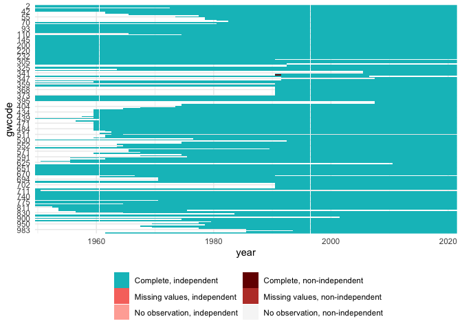<!-- -->

### Check GDP per capita

This uses “population.csv” from the population module.

At least one of the combined GDP values–Qatar in 1971–is clunky in that
there is a big discrepancy. This gives Qatar 1971 an inordinarily high
GDP per capita value. Solved by backward imputing GDP instead of taking
KSG value.

``` r
check <- joint[joint$gwcode==694, ]
par(mfrow = c(2, 2))
for (vn in setdiff(names(check), c("gwcode", "year"))) {
  plot(check$year, check[[vn]], type = "l", main = vn, xlab = NA, ylab = NA)
}
```

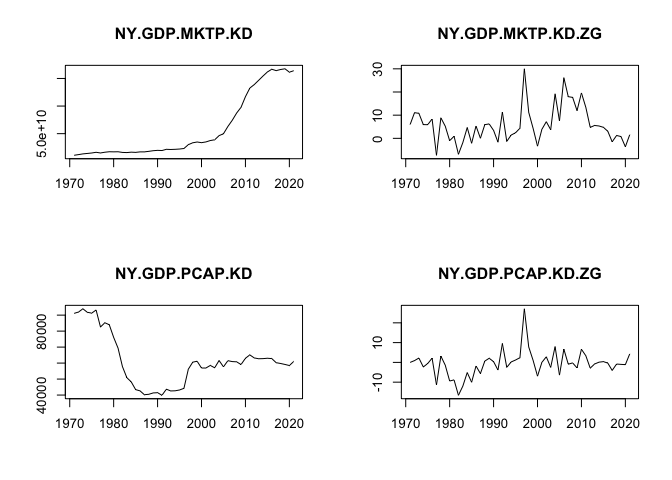<!-- -->

I guess this is fine. (Qatar did really have these crazy high growth
periods, checked the 2001 on data.)

``` r
# Done, write out data ----------------------------------------------------
```

## Done, record summary stats and save

``` r
# Keep a summary of the data so changes in the future are easier to track on 
# git
df <- joint
stats <- list(
  Class           = paste0(class(df), collapse = ", "),
  Size_in_mem     = format(utils::object.size(df), "Mb"),
  N_countries     = length(unique(df$gwcode)),
  Years           = paste0(range(df$year, na.rm = TRUE), collapse = " - "),
  N_columns       = ncol(df),
  Columns         = paste0(colnames(df), collapse = ", "),
  N_rows          = nrow(df),
  N_complete_rows = sum(stats::complete.cases(df))
)
yaml::write_yaml(stats, "output/gdp-signature.yml")
stats
```

    ## $Class
    ## [1] "tbl_df, tbl, data.frame"
    ## 
    ## $Size_in_mem
    ## [1] "0.8 Mb"
    ## 
    ## $N_countries
    ## [1] 204
    ## 
    ## $Years
    ## [1] "1950 - 2021"
    ## 
    ## $N_columns
    ## [1] 6
    ## 
    ## $Columns
    ## [1] "gwcode, year, NY.GDP.MKTP.KD, NY.GDP.MKTP.KD.ZG, NY.GDP.PCAP.KD, NY.GDP.PCAP.KD.ZG"
    ## 
    ## $N_rows
    ## [1] 11597
    ## 
    ## $N_complete_rows
    ## [1] 11565

``` r
write_csv(joint, file = "output/gdp.csv")

setwd(oldwd)
```
