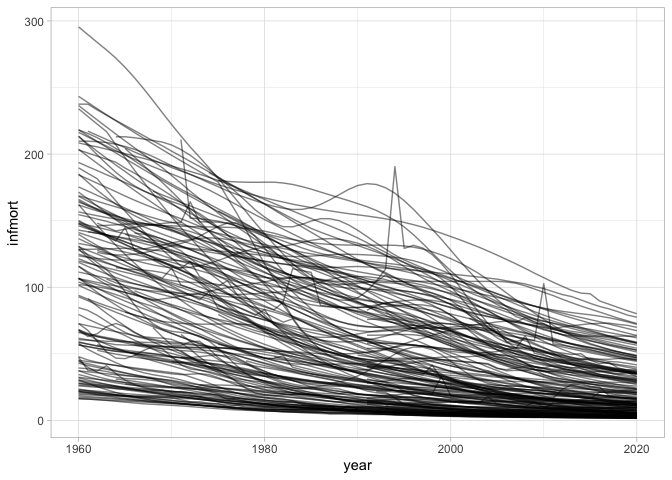
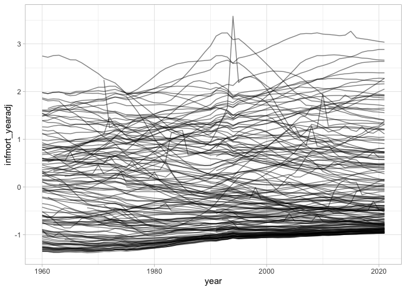

WDI Infant mortality
================

*Last compiled on: 2022-02-19*

Infant mortality data for all countries, 1960 on.

-   The WDI indicator used for this is “SP.DYN.IMRT.IN”.
-   The data were changed to conform as much as possible to the
    Gleditsch & Ward state list.
-   The data are lagged 1 year; the resulting missing values for 1960 or
    the first year of independence if it was after 1960 are imputed by
    using the original 1960/first year of ind. value, i.e. carry back
    imputed.
-   Several countries miss early portions of the data series, e.g. for
    the 50s and 60s. Missing values for those series were imputed using
    a linear model on the square root of infant mortality,
    $\\sqrt{Y} = a + b\\times\\textrm{Year}$, where *a* was picked so
    that the imputed values lined up with the first non-missing
    observation.
-   “infmort_yearadj” is a scaled version adjusted for annual mean and
    sd.

``` r
library(ggplot2)

df <- read.csv("output/wdi-infmort.csv")
dplyr::glimpse(df)
```

    ## Rows: 9,656
    ## Columns: 5
    ## $ gwcode               <int> 2, 2, 2, 2, 2, 2, 2, 2, 2, 2, 2, 2, 2, 2, 2, 2, 2…
    ## $ year                 <int> 1960, 1961, 1962, 1963, 1964, 1965, 1966, 1967, 1…
    ## $ lag1_infmort         <dbl> 25.9, 25.9, 25.4, 24.9, 24.4, 23.8, 23.3, 22.7, 2…
    ## $ lag1_infmort_yearadj <dbl> -1.207425, -1.226920, -1.235888, -1.231060, -1.22…
    ## $ lag1_infmort_imputed <lgl> FALSE, FALSE, FALSE, FALSE, FALSE, FALSE, FALSE, …

``` r
stats <- yaml::read_yaml("output/wdi-infmort-signature.yml")
stats
```

    ## $Class
    ## [1] "tbl_df, tbl, data.frame"
    ## 
    ## $Size_in_mem
    ## [1] "0.3 Mb"
    ## 
    ## $N_countries
    ## [1] 177
    ## 
    ## $Years
    ## [1] "1960 - 2021"
    ## 
    ## $N_columns
    ## [1] 5
    ## 
    ## $Columns
    ## [1] "gwcode, year, lag1_infmort, lag1_infmort_yearadj, lag1_infmort_imputed"
    ## 
    ## $N_rows
    ## [1] 9656
    ## 
    ## $N_complete_rows
    ## [1] 9656

``` r
ggplot(df, aes(x = year, y = lag1_infmort, group = gwcode)) +
  geom_line(alpha = 0.5) +
  theme_light()
```

<!-- -->

``` r
# Scaled version that is adjusted for annual mean and sd
ggplot(df, aes(x = year, y = lag1_infmort_yearadj, group = gwcode)) +
  geom_line(alpha = 0.5) +
  theme_light()
```

<!-- -->

## Data cleaning

See [clean-data.md](clean-data.md) for results of the data cleaning
script.
