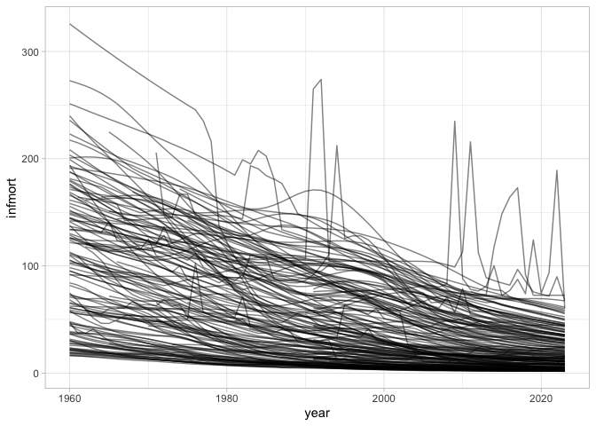
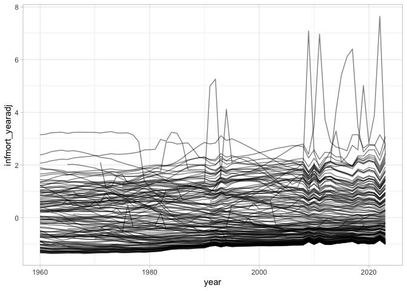

WDI Infant mortality
================

*Last updated on: 2026-01-13*

Infant mortality data for all countries, 1960 on.

- The WDI indicator used for this is “SP.DYN.IMRT.IN”.
- The data were changed to conform as much as possible to the Gleditsch
  & Ward state list.
- Several countries miss early portions of the data series, e.g. for the
  50s and 60s. Missing values for those series were imputed using a
  linear model on the square root of infant mortality,
  $\sqrt{Y} = a + b\times\textrm{Year}$, where *a* was picked so that
  the imputed values lined up with the first non-missing observation.
- “infmort_yearadj” is a scaled version adjusted for annual mean and sd.

``` r
library(ggplot2)

df <- read.csv("output/wdi-infmort.csv")
str(df)
```

    ## 'data.frame':    10006 obs. of  5 variables:
    ##  $ gwcode         : int  2 2 2 2 2 2 2 2 2 2 ...
    ##  $ year           : int  1960 1961 1962 1963 1964 1965 1966 1967 1968 1969 ...
    ##  $ infmort        : num  25.9 25.5 25 24.4 23.9 23.4 22.7 22.1 21.4 20.7 ...
    ##  $ infmort_yearadj: num  -1.19 -1.2 -1.22 -1.21 -1.2 ...
    ##  $ infmort_imputed: logi  FALSE FALSE FALSE FALSE FALSE FALSE ...

``` r
head(df)
```

    ##   gwcode year infmort infmort_yearadj infmort_imputed
    ## 1      2 1960    25.9       -1.194503           FALSE
    ## 2      2 1961    25.5       -1.202578           FALSE
    ## 3      2 1962    25.0       -1.215060           FALSE
    ## 4      2 1963    24.4       -1.212203           FALSE
    ## 5      2 1964    23.9       -1.203649           FALSE
    ## 6      2 1965    23.4       -1.195912           FALSE

``` r
stats <- yaml::read_yaml("output/wdi-infmort-signature.yml")
stats
```

    ## $Class
    ## [1] "tbl_df, tbl, data.frame"
    ## 
    ## $Size_in_mem
    ## [1] "0.3 Mb"
    ## 
    ## $N_countries
    ## [1] 177
    ## 
    ## $Years
    ## [1] "1960 - 2023"
    ## 
    ## $N_columns
    ## [1] 5
    ## 
    ## $Columns
    ## [1] "gwcode, year, infmort, infmort_yearadj, infmort_imputed"
    ## 
    ## $N_rows
    ## [1] 10006
    ## 
    ## $N_complete_rows
    ## [1] 10006

``` r
ggplot(df, aes(x = year, y = infmort, group = gwcode)) +
  geom_line(alpha = 0.5) +
  theme_light()
```

<!-- -->

``` r
# Scaled version that is adjusted for annual mean and sd
ggplot(df, aes(x = year, y = infmort_yearadj, group = gwcode)) +
  geom_line(alpha = 0.5) +
  theme_light()
```

<!-- -->

## Data cleaning

See [clean-data.md](clean-data.md) for results of the data cleaning
script.
