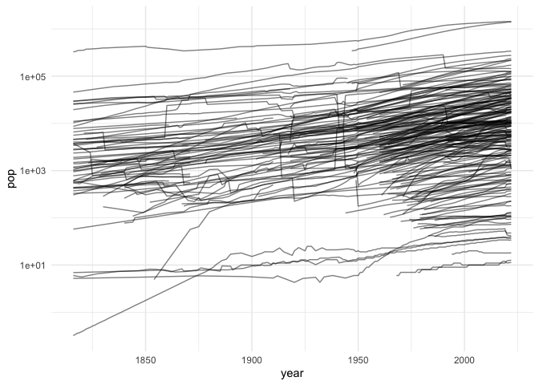

Multi-source population data
================

*Last updated on: 2023-03-23*

Complete G&W coverage population data for 1816 onwards. Preferentially
from UN data for post-1949 data, with drop-ins from WDI and KSG; for
pre-1950 KSG data.

## Usage

``` r
library("dplyr")
library("ggplot2")
library("states")

pop <- read_csv("output/population.csv")
```

    ## Rows: 20258 Columns: 3
    ## ── Column specification ────────────────────────────────────────────────────────
    ## Delimiter: ","
    ## dbl (3): gwcode, year, pop
    ## 
    ## ℹ Use `spec()` to retrieve the full column specification for this data.
    ## ℹ Specify the column types or set `show_col_types = FALSE` to quiet this message.

``` r
range(pop$year)
```

    ## [1] 1816 2022

``` r
str(pop)
```

    ## spc_tbl_ [20,258 × 3] (S3: spec_tbl_df/tbl_df/tbl/data.frame)
    ##  $ gwcode: num [1:20258] 2 2 2 2 2 2 2 2 2 2 ...
    ##  $ year  : num [1:20258] 1816 1817 1818 1819 1820 ...
    ##  $ pop   : num [1:20258] 8659 8899 9139 9379 9618 ...
    ##  - attr(*, "spec")=
    ##   .. cols(
    ##   ..   gwcode = col_double(),
    ##   ..   year = col_double(),
    ##   ..   pop = col_double()
    ##   .. )
    ##  - attr(*, "problems")=<externalptr>

``` r
head(pop)
```

    ## # A tibble: 6 × 3
    ##   gwcode  year   pop
    ##    <dbl> <dbl> <dbl>
    ## 1      2  1816  8659
    ## 2      2  1817  8899
    ## 3      2  1818  9139
    ## 4      2  1819  9379
    ## 5      2  1820  9618
    ## 6      2  1821  9939

``` r
plot_missing(pop, x = "pop", ccode = "gwcode", time = "year", statelist = "GW")
```

<!-- -->

``` r
pop %>%
  ggplot(aes(x = year, y = pop, group = gwcode)) +
  geom_line(alpha = .5) +
  scale_y_log10() + 
  theme_minimal()
```

    ## Warning: Removed 32 rows containing missing values (`geom_line()`).

<!-- -->

``` r
data("gwstates")
still_missing <- pop %>%
  filter(is.na(pop)) %>%
  group_by(gwcode) %>%
  summarize(year = paste0(range(year), collapse = " - "),
            n = n()) %>%
  left_join(gwstates, by = "gwcode") %>%
  select(gwcode, country_name, year, n)
still_missing
```

    ## # A tibble: 3 × 4
    ##   gwcode country_name  year            n
    ##    <dbl> <chr>         <chr>       <int>
    ## 1    396 Abkhazia      2008 - 2022    15
    ## 2    397 South Ossetia 2008 - 2022    15
    ## 3    511 Zanzibar      1963 - 1964     2
