Population
================
Author: Andreas Beger

Last updated on: 23 March 2023

- [Acquire/update raw data](#acquireupdate-raw-data)
  - [Expanded population data from
    KSG](#expanded-population-data-from-ksg)
  - [WDI pop data](#wdi-pop-data)
  - [UN Pop data](#un-pop-data)
- [Combine and overlap](#combine-and-overlap)
  - [Within country covariances between UN and
    KSG](#within-country-covariances-between-un-and-ksg)
  - [Countries where UN, KSG, WDI do not
    agree](#countries-where-un-ksg-wdi-do-not-agree)
  - [Can we combine KSG for pre-50 with
    UN?](#can-we-combine-ksg-for-pre-50-with-un)
  - [Germany](#germany)
  - [Vietnam](#vietnam)
  - [Yemen](#yemen)
  - [Kosovo](#kosovo)
  - [Tibet](#tibet)
  - [Czechoslovakia](#czechoslovakia)
- [Get ready to write final data](#get-ready-to-write-final-data)
  - [Check values for splitting/joining
    countries](#check-values-for-splittingjoining-countries)
  - [Missingness](#missingness)

NOTE: This file is generated from README.R. To spint/knit/compile the
.md file, run:  
`setwd("population"); rmarkdown::render("clean-population.R")`

This file combines UN, WDI, and KSG population data to create a complete
coverage dataset for 1950 onwards, with no major states missing.

The data sources are:

- <https://population.un.org/wpp/DataQuery/>: select total population by
  sex and SDG regions; only 35 years can be exported at a time so three
  files are needed
- <http://ksgleditsch.com/data/exppop.txt>
- World Bank, via the WDI package

To update the data:

1.  Download a new version of the UN population dataset at
    <https://population.un.org/dataportal/>. Only 35 years can be
    exported at a time so three files are needed. Select total
    population by sex, countries, years needed, then search. In the
    resulting display, on the display tab select Locations \>
    Characteristics \> Variants, then in Settings select “Scaling
    Factor” as ‘k’. This gets data in the previous format. Export to
    Excel and rename the output file to match the pattern in the
    `input/` folder.
2.  Delete “input/wdipop.csv”; it’ll be downloaded and cached again.
3.  Search for “UPDATE:” for lines in this document that need attention,
    possibly.

``` r
suppressPackageStartupMessages({
  library(dplyr)
  library(states)
  library(WDI)
  library(lubridate)
  library(readxl)
  library(kableExtra)
  library(imputeTS)
  library(here)
  library(purrr)
})

oldwd <- getwd()
setwd(here::here("population"))


# Functions ----------------------------------------------------------

wdi_add_gwcode <- function(x) {
  starty <- min(x$year)
  endy <- max(x$year)
  cy <- states::state_panel(starty, endy, useGW = TRUE, partial = "any")
  
  x <- x %>%
    mutate(gwcode = suppressWarnings(countrycode::countrycode(x$iso2c, "iso2c", "cown")),
           gwcode = as.integer(gwcode)) %>%
    mutate(gwcode = case_when(
      iso2c=="RS" ~ 340L,
      iso2c=="XK" ~ 347L,
      iso2c=="VN" ~ 816L,
      
      gwcode==255 ~ 260L,
      gwcode==679 ~ 678L,
      
      gwcode==970 ~ 971L,
      gwcode==946 ~ 970L,
      gwcode==947 ~ 973L,
      gwcode==955 ~ 972L,
      TRUE ~ gwcode
    ))
  
  # fix Czechoslovakia
  x$gwcode[x$gwcode==316 & x$year <= 1992] <- 315L
  
  # drop countries that unify
  x <- x %>%
    # pre-95 Serbia
    filter(!(gwcode==340 & year < 1995)) %>%
    filter(!(gwcode==260 & year < 1990)) %>%
    filter(!(gwcode==678 & year < 1990)) %>%
    # pre-75 Vietnam
    filter(!(gwcode==816 & year < 1975)) 
  
  x <- dplyr::select(x, -iso2c, -country)
  x <- x %>% filter(!is.na(gwcode))
  
  cy <- dplyr::left_join(cy, x, by = c("gwcode", "year"))
  cy
}

data(gwstates)
cnames <- gwstates %>%
  group_by(gwcode) %>% 
  slice(n()) %>%
  select(gwcode, country_name) %>%
  ungroup()


# Acquire/update raw data -------------------------------------------------
```

## Acquire/update raw data

### Expanded population data from KSG

Data are at <http://ksgleditsch.com/data/exppop.txt>

``` r
if (!file.exists("input/exppop.tsv")) {
  url <- "http://ksgleditsch.com/data/exppop.txt"
  download.file(url, destfile = "input/exppop.tsv")
}

ksg <- read_tsv("input/exppop.tsv")
```

    ## Rows: 16729 Columns: 5
    ## ── Column specification ────────────────────────────────────────────────────────────────
    ## Delimiter: "\t"
    ## chr (1): idacr
    ## dbl (4): idnum, year, pop, source
    ## 
    ## ℹ Use `spec()` to retrieve the full column specification for this data.
    ## ℹ Specify the column types or set `show_col_types = FALSE` to quiet this message.

The data range from 1816 to 2004.

``` r
plot_missing(ksg, x = "pop", ccode = "idnum", time = "year", statelist = "GW")
```

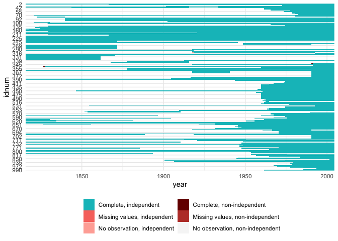<!-- -->

``` r
# These data only go to 2004. Need to splice in updates. 
```

### WDI pop data

Via the WB API thanks to WDI package.

``` r
# UPDATE: delete input/wdipop.csv to re-download
if (!file.exists("input/wdipop.csv")) {
  wdi_raw <- WDI(country = "all", indicator = "SP.POP.TOTL", 
               start = 1960, end = year(Sys.Date()), extra = FALSE) 
  write.csv(wdi_raw, "input/wdipop.csv", row.names = FALSE)
}

wdi_raw <- read.csv("input/wdipop.csv")

wdi <- wdi_raw %>% wdi_add_gwcode(.) %>%
  rename(pop = SP.POP.TOTL) %>%
  # change to pop in 1,000s
  mutate(pop = pop / 1e3)

plot_missing(wdi, x = "pop", ccode = "gwcode", time = "year", statelist = "GW")
```

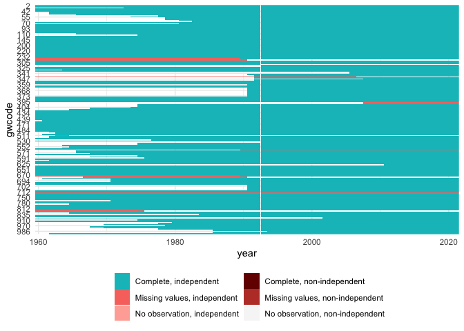<!-- -->

``` r
# UN Pop data -------------------------------------------------------------
```

### UN Pop data

``` r
files <- dir("input", pattern = "^UNPop", full.names = TRUE)

# 2023-03: the data portal at the UN website has changed, giving different
# output format now as well. So make separate parser functions. 
parse_un_wide <- function(x) {
  # data are iso, location, ..., year1, year2, ...
  df <- readxl::read_xlsx(x, sheet = "Data", skip = 1)
  df <- rename(df, iso3n = `ISO 3166-1 numeric code`)
  df$Sex <- df$Note <- NULL
  df <- df[df$iso3n < 900, ]
  df <- tidyr::pivot_longer(df, -c(iso3n, Location), names_to = "year", values_to = "pop")
  df$year <- as.integer(df$year)
  df$iso3n <- as.character(df$iso3n)
  df
}
parse_un_long <- function(x) {
  # data are iso, location, year, indicator
  df <- readxl::read_xlsx(x, sheet = "Data", skip = 5, 
                          col_names = c("iso3n", "Location", "year", "pop"))
  df$year <- as.integer(df$year)
  df
}
parse_un <- function(file) {
  x <- readxl::read_xlsx(file, sheet = "Data", range = "A1")
  if (length(x)==0) {
    out <- parse_un_long(file)
  } else if (names(x)=="Total Population by sex (thousands)") {
    out <- parse_un_wide(file)
  } else {
    stop("unexpected input")
  }
  out
}

# This is the UN pop data for countries, taking out the region aggregations
un_raw <- files %>%
  # read in data
  map(., parse_un) %>%
  purrr::reduce(rbind) 

# UPDATE: drop the last year of data; i just didn't want to export a file with a 
# single year
drop_year <- 2023
un_raw <- un_raw[!un_raw$year==drop_year, ] 

# Add GW codes
un <- un_raw %>%
  mutate(gwcode = countrycode::countrycode(iso3n, "iso3n", "cown", warn = FALSE),
         gwcode = as.integer(gwcode)) %>%
  mutate(gwcode = case_when(
      Location=="Serbia" ~ 340L, 
      gwcode==255 ~ 260L,
      gwcode==679 ~ 678L,
      gwcode==970 ~ 971L,
      gwcode==946 ~ 970L,
      gwcode==947 ~ 973L,
      gwcode==955 ~ 972L,
      gwcode==817 ~ 816L,
      TRUE ~ gwcode
  )) 

un <- un %>%
  filter(!is.na(gwcode))
```

#### Reconstruct some countries that later split

Since the UN data has series for all current countries going back to
1950, we can use those to re-construct countries like USSR and
Yugoslavia that today are several countries. \#### Czechoslovakia

Czechia and Slovakia split on 1 January 1993.

``` r
add <- tibble(
  gwcode = 315, 
  year = 1950:1992,
  pop = rowSums(cbind(un$pop[un$gwcode==316 & un$year < 1993], 
                         un$pop[un$gwcode==317 & un$year < 1993]))
)
un <- bind_rows(un, add) %>%
  filter(!(gwcode==316 & year < 1993),
         !(gwcode==317 & year < 1993))
```

#### Pakistan pre-1971

Before East Pakistan became Bangladesh.

``` r
pak70 <- rowSums(cbind(un$pop[un$gwcode==770 & un$year < 1970], 
                       un$pop[un$gwcode==771 & un$year < 1970]))
un$pop[un$gwcode==770 & un$year < 1970] <- pak70
```

#### Yugoslavia/Serbia & Montenegro/Serbia

- 1990 and before: Slovenia, Croatia, BiH, Serbia, Kosovo, (UN does not
  seem to treat it separately), Montenegro, Macedonia
- 1991: Slovenia, Croatia, BiH, Serbia, Kosovo, (UN does not seem to
  treat it separately), Montenegro
- 1992 and until 2006: Serbia, Kosovo, Montenegro

``` r
yugo <- tibble(
  gwcode = 345,
  year = 1950:2006,
  pop  = rowSums(cbind(
    # Serbia and Montenegro
    un$pop[un$gwcode==340 & un$year <= 2006],
    un$pop[un$gwcode==341 & un$year <= 2006],
    # Slovenia, Croatia, BiH
    c(un$pop[un$gwcode==349 & un$year <= 1991], rep(0, 15)),
    c(un$pop[un$gwcode==344 & un$year <= 1991], rep(0, 15)),
    c(un$pop[un$gwcode==346 & un$year <= 1991], rep(0, 15)),
    # Macedonia
    c(un$pop[un$gwcode==343 & un$year <= 1990], rep(0, 16))
  )))

plot(yugo$year, yugo$pop, ylim = c(0, 25e3), type = "l")
```

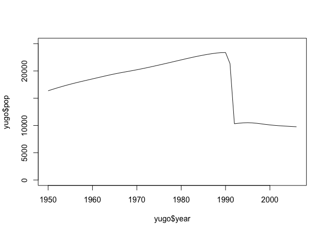<!-- -->

``` r
un <- un %>%
  filter(!(gwcode==340 & year < 2006),
         !(gwcode==341 & year < 2006),
         !(gwcode==343 & year < 1991),
         !(gwcode==344 & year < 1992),
         !(gwcode==346 & year < 1992),
         !(gwcode==349 & year < 1992)) %>%
  bind_rows(., yugo) 
```

##### USSR/Russia

- 1990 and before: Russia (365), the Baltics (366, 367, 368), Ukraine
  (369), Belarus (370), Armenia (371), Georgia (372), Azerbaijan (373),
  central Asia (701, 702, 703, 704, 705)
- 1991 and on: 365

``` r
ussr <- tibble(
  gwcode = 365,
  year = 1950:1990,
  pop = rowSums(cbind(
    un$pop[un$gwcode==365 & un$year < 1991],
    un$pop[un$gwcode==366 & un$year < 1991],
    un$pop[un$gwcode==367 & un$year < 1991],
    un$pop[un$gwcode==368 & un$year < 1991],
    un$pop[un$gwcode==369 & un$year < 1991],
    un$pop[un$gwcode==370 & un$year < 1991],
    un$pop[un$gwcode==371 & un$year < 1991],
    un$pop[un$gwcode==372 & un$year < 1991],
    un$pop[un$gwcode==373 & un$year < 1991],
    un$pop[un$gwcode==701 & un$year < 1991],
    un$pop[un$gwcode==702 & un$year < 1991],
    un$pop[un$gwcode==703 & un$year < 1991],
    un$pop[un$gwcode==704 & un$year < 1991],
    un$pop[un$gwcode==705 & un$year < 1991]
  ))
)

un <- un %>% 
  filter(
    !(gwcode==365 & year < 1991),
    !(gwcode==366 & year < 1991),
    !(gwcode==367 & year < 1991),
    !(gwcode==368 & year < 1991),
    !(gwcode==369 & year < 1991),
    !(gwcode==370 & year < 1991),
    !(gwcode==371 & year < 1991),
    !(gwcode==372 & year < 1991),
    !(gwcode==373 & year < 1991),
    !(gwcode==701 & year < 1991),
    !(gwcode==702 & year < 1991),
    !(gwcode==703 & year < 1991),
    !(gwcode==704 & year < 1991),
    !(gwcode==705 & year < 1991)
    ) %>%
  bind_rows(., ussr)
```

#### Sudan/South Sudan

South Sudan independent on . So use combined for 2011 and before.

``` r
sud <- rowSums(cbind(un$pop[un$gwcode==625 & un$year <= 2011], 
                     un$pop[un$gwcode==626 & un$year <= 2011]))
un$pop[un$gwcode==625 & un$year <= 2011] <- sud
```

#### Indonesia/East Timor

East Timor gained independence in 2002, so use combined for 2001 and
before.

``` r
ind <- rowSums(cbind(un$pop[un$gwcode==850 & un$year <= 2001], 
                     un$pop[un$gwcode==860 & un$year <= 2001]))
un$pop[un$gwcode==850 & un$year <= 2001] <- ind
```

#### Check left-over discrepancies

Unions like GDR joining FRG are problematic and have to be fixed
outside.

- German re-unification
- Yemeni unification
- Vietnamese unification

Other discrepancies in the data:

``` r
# UPDATE: end_year
end_year <- 2022
gw <- state_panel(1950, end_year, partial = "any")
gw_not_in_un <- gw %>%
  anti_join(un, by = c("gwcode", "year")) %>%
  group_by(gwcode) %>%
  mutate(seq = id_date_sequence(year, "year")) %>%
  group_by(gwcode, seq) %>%
  summarize(years = paste0(range(year), collapse = " - "),
            .groups = "drop") %>%
  left_join(cnames, by = "gwcode") 
gw_not_in_un %>%
  knitr::kable(caption = "GW CYs not in UN") 
```

<table>
<caption>
GW CYs not in UN
</caption>
<thead>
<tr>
<th style="text-align:right;">
gwcode
</th>
<th style="text-align:right;">
seq
</th>
<th style="text-align:left;">
years
</th>
<th style="text-align:left;">
country_name
</th>
</tr>
</thead>
<tbody>
<tr>
<td style="text-align:right;">
265
</td>
<td style="text-align:right;">
1
</td>
<td style="text-align:left;">
1950 - 1990
</td>
<td style="text-align:left;">
German Democratic Republic
</td>
</tr>
<tr>
<td style="text-align:right;">
347
</td>
<td style="text-align:right;">
1
</td>
<td style="text-align:left;">
2008 - 2022
</td>
<td style="text-align:left;">
Kosovo
</td>
</tr>
<tr>
<td style="text-align:right;">
396
</td>
<td style="text-align:right;">
1
</td>
<td style="text-align:left;">
2008 - 2022
</td>
<td style="text-align:left;">
Abkhazia
</td>
</tr>
<tr>
<td style="text-align:right;">
397
</td>
<td style="text-align:right;">
1
</td>
<td style="text-align:left;">
2008 - 2022
</td>
<td style="text-align:left;">
South Ossetia
</td>
</tr>
<tr>
<td style="text-align:right;">
511
</td>
<td style="text-align:right;">
1
</td>
<td style="text-align:left;">
1963 - 1964
</td>
<td style="text-align:left;">
Zanzibar
</td>
</tr>
<tr>
<td style="text-align:right;">
680
</td>
<td style="text-align:right;">
1
</td>
<td style="text-align:left;">
1967 - 1990
</td>
<td style="text-align:left;">
Yemen, People’s Republic of
</td>
</tr>
<tr>
<td style="text-align:right;">
711
</td>
<td style="text-align:right;">
1
</td>
<td style="text-align:left;">
1950 - 1950
</td>
<td style="text-align:left;">
Tibet
</td>
</tr>
<tr>
<td style="text-align:right;">
817
</td>
<td style="text-align:right;">
1
</td>
<td style="text-align:left;">
1954 - 1975
</td>
<td style="text-align:left;">
Vietnam, Republic of
</td>
</tr>
</tbody>
</table>

``` r
un_not_in_gw <- un %>%
  anti_join(gw, by = c("gwcode", "year")) %>%
  group_by(gwcode) %>%
  mutate(seq = id_date_sequence(year, "year")) %>%
  group_by(gwcode, seq) %>%
  summarize(years = paste0(range(year), collapse = " - "),
            .groups = "drop") %>%
  left_join(cnames, by = "gwcode") 
un_not_in_gw %>%
  knitr::kable(caption = "UN CYs not in GW")
```

<table>
<caption>
UN CYs not in GW
</caption>
<thead>
<tr>
<th style="text-align:right;">
gwcode
</th>
<th style="text-align:right;">
seq
</th>
<th style="text-align:left;">
years
</th>
<th style="text-align:left;">
country_name
</th>
</tr>
</thead>
<tbody>
<tr>
<td style="text-align:right;">
31
</td>
<td style="text-align:right;">
1
</td>
<td style="text-align:left;">
1950 - 1972
</td>
<td style="text-align:left;">
Bahamas
</td>
</tr>
<tr>
<td style="text-align:right;">
51
</td>
<td style="text-align:right;">
1
</td>
<td style="text-align:left;">
1950 - 1961
</td>
<td style="text-align:left;">
Jamaica
</td>
</tr>
<tr>
<td style="text-align:right;">
52
</td>
<td style="text-align:right;">
1
</td>
<td style="text-align:left;">
1950 - 1961
</td>
<td style="text-align:left;">
Trinidad and Tobago
</td>
</tr>
<tr>
<td style="text-align:right;">
53
</td>
<td style="text-align:right;">
1
</td>
<td style="text-align:left;">
1950 - 1965
</td>
<td style="text-align:left;">
Barbados
</td>
</tr>
<tr>
<td style="text-align:right;">
54
</td>
<td style="text-align:right;">
1
</td>
<td style="text-align:left;">
1950 - 1977
</td>
<td style="text-align:left;">
Dominica
</td>
</tr>
<tr>
<td style="text-align:right;">
55
</td>
<td style="text-align:right;">
1
</td>
<td style="text-align:left;">
1950 - 1973
</td>
<td style="text-align:left;">
Grenada
</td>
</tr>
<tr>
<td style="text-align:right;">
56
</td>
<td style="text-align:right;">
1
</td>
<td style="text-align:left;">
1950 - 1978
</td>
<td style="text-align:left;">
Saint Lucia
</td>
</tr>
<tr>
<td style="text-align:right;">
57
</td>
<td style="text-align:right;">
1
</td>
<td style="text-align:left;">
1950 - 1978
</td>
<td style="text-align:left;">
Saint Vincent and the Grenadines
</td>
</tr>
<tr>
<td style="text-align:right;">
58
</td>
<td style="text-align:right;">
1
</td>
<td style="text-align:left;">
1950 - 1980
</td>
<td style="text-align:left;">
Antigua & Barbuda
</td>
</tr>
<tr>
<td style="text-align:right;">
60
</td>
<td style="text-align:right;">
1
</td>
<td style="text-align:left;">
1950 - 1982
</td>
<td style="text-align:left;">
Saint Kitts and Nevis
</td>
</tr>
<tr>
<td style="text-align:right;">
80
</td>
<td style="text-align:right;">
1
</td>
<td style="text-align:left;">
1950 - 1980
</td>
<td style="text-align:left;">
Belize
</td>
</tr>
<tr>
<td style="text-align:right;">
110
</td>
<td style="text-align:right;">
1
</td>
<td style="text-align:left;">
1950 - 1965
</td>
<td style="text-align:left;">
Guyana
</td>
</tr>
<tr>
<td style="text-align:right;">
115
</td>
<td style="text-align:right;">
1
</td>
<td style="text-align:left;">
1950 - 1974
</td>
<td style="text-align:left;">
Surinam
</td>
</tr>
<tr>
<td style="text-align:right;">
327
</td>
<td style="text-align:right;">
1
</td>
<td style="text-align:left;">
1950 - 2019
</td>
<td style="text-align:left;">
Papal States
</td>
</tr>
<tr>
<td style="text-align:right;">
338
</td>
<td style="text-align:right;">
1
</td>
<td style="text-align:left;">
1950 - 1963
</td>
<td style="text-align:left;">
Malta
</td>
</tr>
<tr>
<td style="text-align:right;">
352
</td>
<td style="text-align:right;">
1
</td>
<td style="text-align:left;">
1950 - 1959
</td>
<td style="text-align:left;">
Cyprus
</td>
</tr>
<tr>
<td style="text-align:right;">
359
</td>
<td style="text-align:right;">
1
</td>
<td style="text-align:left;">
1950 - 1990
</td>
<td style="text-align:left;">
Moldova
</td>
</tr>
<tr>
<td style="text-align:right;">
402
</td>
<td style="text-align:right;">
1
</td>
<td style="text-align:left;">
1950 - 1974
</td>
<td style="text-align:left;">
Cape Verde
</td>
</tr>
<tr>
<td style="text-align:right;">
403
</td>
<td style="text-align:right;">
1
</td>
<td style="text-align:left;">
1950 - 1974
</td>
<td style="text-align:left;">
Sao Tome and Principe
</td>
</tr>
<tr>
<td style="text-align:right;">
404
</td>
<td style="text-align:right;">
1
</td>
<td style="text-align:left;">
1950 - 1973
</td>
<td style="text-align:left;">
Guinea-Bissau
</td>
</tr>
<tr>
<td style="text-align:right;">
411
</td>
<td style="text-align:right;">
1
</td>
<td style="text-align:left;">
1950 - 1967
</td>
<td style="text-align:left;">
Equatorial Guinea
</td>
</tr>
<tr>
<td style="text-align:right;">
420
</td>
<td style="text-align:right;">
1
</td>
<td style="text-align:left;">
1950 - 1964
</td>
<td style="text-align:left;">
Gambia
</td>
</tr>
<tr>
<td style="text-align:right;">
432
</td>
<td style="text-align:right;">
1
</td>
<td style="text-align:left;">
1950 - 1959
</td>
<td style="text-align:left;">
Mali
</td>
</tr>
<tr>
<td style="text-align:right;">
433
</td>
<td style="text-align:right;">
1
</td>
<td style="text-align:left;">
1950 - 1959
</td>
<td style="text-align:left;">
Senegal
</td>
</tr>
<tr>
<td style="text-align:right;">
434
</td>
<td style="text-align:right;">
1
</td>
<td style="text-align:left;">
1950 - 1959
</td>
<td style="text-align:left;">
Benin
</td>
</tr>
<tr>
<td style="text-align:right;">
435
</td>
<td style="text-align:right;">
1
</td>
<td style="text-align:left;">
1950 - 1959
</td>
<td style="text-align:left;">
Mauritania
</td>
</tr>
<tr>
<td style="text-align:right;">
436
</td>
<td style="text-align:right;">
1
</td>
<td style="text-align:left;">
1950 - 1959
</td>
<td style="text-align:left;">
Niger
</td>
</tr>
<tr>
<td style="text-align:right;">
437
</td>
<td style="text-align:right;">
1
</td>
<td style="text-align:left;">
1950 - 1959
</td>
<td style="text-align:left;">
Cote D’Ivoire
</td>
</tr>
<tr>
<td style="text-align:right;">
438
</td>
<td style="text-align:right;">
1
</td>
<td style="text-align:left;">
1950 - 1957
</td>
<td style="text-align:left;">
Guinea
</td>
</tr>
<tr>
<td style="text-align:right;">
439
</td>
<td style="text-align:right;">
1
</td>
<td style="text-align:left;">
1950 - 1959
</td>
<td style="text-align:left;">
Burkina Faso (Upper Volta)
</td>
</tr>
<tr>
<td style="text-align:right;">
451
</td>
<td style="text-align:right;">
1
</td>
<td style="text-align:left;">
1950 - 1960
</td>
<td style="text-align:left;">
Sierra Leone
</td>
</tr>
<tr>
<td style="text-align:right;">
452
</td>
<td style="text-align:right;">
1
</td>
<td style="text-align:left;">
1950 - 1956
</td>
<td style="text-align:left;">
Ghana
</td>
</tr>
<tr>
<td style="text-align:right;">
461
</td>
<td style="text-align:right;">
1
</td>
<td style="text-align:left;">
1950 - 1959
</td>
<td style="text-align:left;">
Togo
</td>
</tr>
<tr>
<td style="text-align:right;">
471
</td>
<td style="text-align:right;">
1
</td>
<td style="text-align:left;">
1950 - 1959
</td>
<td style="text-align:left;">
Cameroon
</td>
</tr>
<tr>
<td style="text-align:right;">
475
</td>
<td style="text-align:right;">
1
</td>
<td style="text-align:left;">
1950 - 1959
</td>
<td style="text-align:left;">
Nigeria
</td>
</tr>
<tr>
<td style="text-align:right;">
481
</td>
<td style="text-align:right;">
1
</td>
<td style="text-align:left;">
1950 - 1959
</td>
<td style="text-align:left;">
Gabon
</td>
</tr>
<tr>
<td style="text-align:right;">
482
</td>
<td style="text-align:right;">
1
</td>
<td style="text-align:left;">
1950 - 1959
</td>
<td style="text-align:left;">
Central African Republic
</td>
</tr>
<tr>
<td style="text-align:right;">
483
</td>
<td style="text-align:right;">
1
</td>
<td style="text-align:left;">
1950 - 1959
</td>
<td style="text-align:left;">
Chad
</td>
</tr>
<tr>
<td style="text-align:right;">
484
</td>
<td style="text-align:right;">
1
</td>
<td style="text-align:left;">
1950 - 1959
</td>
<td style="text-align:left;">
Congo
</td>
</tr>
<tr>
<td style="text-align:right;">
490
</td>
<td style="text-align:right;">
1
</td>
<td style="text-align:left;">
1950 - 1959
</td>
<td style="text-align:left;">
Congo, Democratic Republic of (Zaire)
</td>
</tr>
<tr>
<td style="text-align:right;">
500
</td>
<td style="text-align:right;">
1
</td>
<td style="text-align:left;">
1950 - 1961
</td>
<td style="text-align:left;">
Uganda
</td>
</tr>
<tr>
<td style="text-align:right;">
501
</td>
<td style="text-align:right;">
1
</td>
<td style="text-align:left;">
1950 - 1962
</td>
<td style="text-align:left;">
Kenya
</td>
</tr>
<tr>
<td style="text-align:right;">
510
</td>
<td style="text-align:right;">
1
</td>
<td style="text-align:left;">
1950 - 1960
</td>
<td style="text-align:left;">
Tanzania/Tanganyika
</td>
</tr>
<tr>
<td style="text-align:right;">
516
</td>
<td style="text-align:right;">
1
</td>
<td style="text-align:left;">
1950 - 1961
</td>
<td style="text-align:left;">
Burundi
</td>
</tr>
<tr>
<td style="text-align:right;">
517
</td>
<td style="text-align:right;">
1
</td>
<td style="text-align:left;">
1950 - 1961
</td>
<td style="text-align:left;">
Rwanda
</td>
</tr>
<tr>
<td style="text-align:right;">
520
</td>
<td style="text-align:right;">
1
</td>
<td style="text-align:left;">
1950 - 1959
</td>
<td style="text-align:left;">
Somalia
</td>
</tr>
<tr>
<td style="text-align:right;">
522
</td>
<td style="text-align:right;">
1
</td>
<td style="text-align:left;">
1950 - 1976
</td>
<td style="text-align:left;">
Djibouti
</td>
</tr>
<tr>
<td style="text-align:right;">
531
</td>
<td style="text-align:right;">
1
</td>
<td style="text-align:left;">
1950 - 1992
</td>
<td style="text-align:left;">
Eritrea
</td>
</tr>
<tr>
<td style="text-align:right;">
540
</td>
<td style="text-align:right;">
1
</td>
<td style="text-align:left;">
1950 - 1974
</td>
<td style="text-align:left;">
Angola
</td>
</tr>
<tr>
<td style="text-align:right;">
541
</td>
<td style="text-align:right;">
1
</td>
<td style="text-align:left;">
1950 - 1974
</td>
<td style="text-align:left;">
Mozambique
</td>
</tr>
<tr>
<td style="text-align:right;">
551
</td>
<td style="text-align:right;">
1
</td>
<td style="text-align:left;">
1950 - 1963
</td>
<td style="text-align:left;">
Zambia
</td>
</tr>
<tr>
<td style="text-align:right;">
552
</td>
<td style="text-align:right;">
1
</td>
<td style="text-align:left;">
1950 - 1964
</td>
<td style="text-align:left;">
Zimbabwe (Rhodesia)
</td>
</tr>
<tr>
<td style="text-align:right;">
553
</td>
<td style="text-align:right;">
1
</td>
<td style="text-align:left;">
1950 - 1963
</td>
<td style="text-align:left;">
Malawi
</td>
</tr>
<tr>
<td style="text-align:right;">
565
</td>
<td style="text-align:right;">
1
</td>
<td style="text-align:left;">
1950 - 1989
</td>
<td style="text-align:left;">
Namibia
</td>
</tr>
<tr>
<td style="text-align:right;">
570
</td>
<td style="text-align:right;">
1
</td>
<td style="text-align:left;">
1950 - 1965
</td>
<td style="text-align:left;">
Lesotho
</td>
</tr>
<tr>
<td style="text-align:right;">
571
</td>
<td style="text-align:right;">
1
</td>
<td style="text-align:left;">
1950 - 1965
</td>
<td style="text-align:left;">
Botswana
</td>
</tr>
<tr>
<td style="text-align:right;">
572
</td>
<td style="text-align:right;">
1
</td>
<td style="text-align:left;">
1950 - 1967
</td>
<td style="text-align:left;">
Swaziland
</td>
</tr>
<tr>
<td style="text-align:right;">
580
</td>
<td style="text-align:right;">
1
</td>
<td style="text-align:left;">
1950 - 1959
</td>
<td style="text-align:left;">
Madagascar
</td>
</tr>
<tr>
<td style="text-align:right;">
581
</td>
<td style="text-align:right;">
1
</td>
<td style="text-align:left;">
1950 - 1974
</td>
<td style="text-align:left;">
Comoros
</td>
</tr>
<tr>
<td style="text-align:right;">
590
</td>
<td style="text-align:right;">
1
</td>
<td style="text-align:left;">
1950 - 1967
</td>
<td style="text-align:left;">
Mauritius
</td>
</tr>
<tr>
<td style="text-align:right;">
591
</td>
<td style="text-align:right;">
1
</td>
<td style="text-align:left;">
1950 - 1975
</td>
<td style="text-align:left;">
Seychelles
</td>
</tr>
<tr>
<td style="text-align:right;">
600
</td>
<td style="text-align:right;">
1
</td>
<td style="text-align:left;">
1950 - 1955
</td>
<td style="text-align:left;">
Morocco
</td>
</tr>
<tr>
<td style="text-align:right;">
615
</td>
<td style="text-align:right;">
1
</td>
<td style="text-align:left;">
1950 - 1961
</td>
<td style="text-align:left;">
Algeria
</td>
</tr>
<tr>
<td style="text-align:right;">
616
</td>
<td style="text-align:right;">
1
</td>
<td style="text-align:left;">
1950 - 1955
</td>
<td style="text-align:left;">
Tunisia
</td>
</tr>
<tr>
<td style="text-align:right;">
620
</td>
<td style="text-align:right;">
1
</td>
<td style="text-align:left;">
1950 - 1950
</td>
<td style="text-align:left;">
Libya
</td>
</tr>
<tr>
<td style="text-align:right;">
625
</td>
<td style="text-align:right;">
1
</td>
<td style="text-align:left;">
1950 - 1955
</td>
<td style="text-align:left;">
Sudan
</td>
</tr>
<tr>
<td style="text-align:right;">
626
</td>
<td style="text-align:right;">
1
</td>
<td style="text-align:left;">
1950 - 2010
</td>
<td style="text-align:left;">
South Sudan
</td>
</tr>
<tr>
<td style="text-align:right;">
690
</td>
<td style="text-align:right;">
1
</td>
<td style="text-align:left;">
1950 - 1960
</td>
<td style="text-align:left;">
Kuwait
</td>
</tr>
<tr>
<td style="text-align:right;">
692
</td>
<td style="text-align:right;">
1
</td>
<td style="text-align:left;">
1950 - 1970
</td>
<td style="text-align:left;">
Bahrain
</td>
</tr>
<tr>
<td style="text-align:right;">
694
</td>
<td style="text-align:right;">
1
</td>
<td style="text-align:left;">
1950 - 1970
</td>
<td style="text-align:left;">
Qatar
</td>
</tr>
<tr>
<td style="text-align:right;">
696
</td>
<td style="text-align:right;">
1
</td>
<td style="text-align:left;">
1950 - 1970
</td>
<td style="text-align:left;">
United Arab Emirates
</td>
</tr>
<tr>
<td style="text-align:right;">
771
</td>
<td style="text-align:right;">
1
</td>
<td style="text-align:left;">
1950 - 1970
</td>
<td style="text-align:left;">
Bangladesh
</td>
</tr>
<tr>
<td style="text-align:right;">
781
</td>
<td style="text-align:right;">
1
</td>
<td style="text-align:left;">
1950 - 1964
</td>
<td style="text-align:left;">
Maldives
</td>
</tr>
<tr>
<td style="text-align:right;">
811
</td>
<td style="text-align:right;">
1
</td>
<td style="text-align:left;">
1950 - 1952
</td>
<td style="text-align:left;">
Cambodia (Kampuchea)
</td>
</tr>
<tr>
<td style="text-align:right;">
812
</td>
<td style="text-align:right;">
1
</td>
<td style="text-align:left;">
1950 - 1953
</td>
<td style="text-align:left;">
Laos
</td>
</tr>
<tr>
<td style="text-align:right;">
816
</td>
<td style="text-align:right;">
1
</td>
<td style="text-align:left;">
1950 - 1953
</td>
<td style="text-align:left;">
Vietnam, Democratic Republic of
</td>
</tr>
<tr>
<td style="text-align:right;">
820
</td>
<td style="text-align:right;">
1
</td>
<td style="text-align:left;">
1950 - 1956
</td>
<td style="text-align:left;">
Malaysia
</td>
</tr>
<tr>
<td style="text-align:right;">
830
</td>
<td style="text-align:right;">
1
</td>
<td style="text-align:left;">
1950 - 1964
</td>
<td style="text-align:left;">
Singapore
</td>
</tr>
<tr>
<td style="text-align:right;">
835
</td>
<td style="text-align:right;">
1
</td>
<td style="text-align:left;">
1950 - 1983
</td>
<td style="text-align:left;">
Brunei
</td>
</tr>
<tr>
<td style="text-align:right;">
860
</td>
<td style="text-align:right;">
1
</td>
<td style="text-align:left;">
1950 - 2001
</td>
<td style="text-align:left;">
East Timor
</td>
</tr>
<tr>
<td style="text-align:right;">
910
</td>
<td style="text-align:right;">
1
</td>
<td style="text-align:left;">
1950 - 1974
</td>
<td style="text-align:left;">
Papua New Guinea
</td>
</tr>
<tr>
<td style="text-align:right;">
935
</td>
<td style="text-align:right;">
1
</td>
<td style="text-align:left;">
1950 - 1979
</td>
<td style="text-align:left;">
Vanuatu
</td>
</tr>
<tr>
<td style="text-align:right;">
940
</td>
<td style="text-align:right;">
1
</td>
<td style="text-align:left;">
1950 - 1977
</td>
<td style="text-align:left;">
Solomon Islands
</td>
</tr>
<tr>
<td style="text-align:right;">
950
</td>
<td style="text-align:right;">
1
</td>
<td style="text-align:left;">
1950 - 1969
</td>
<td style="text-align:left;">
Fiji
</td>
</tr>
<tr>
<td style="text-align:right;">
970
</td>
<td style="text-align:right;">
1
</td>
<td style="text-align:left;">
1950 - 1978
</td>
<td style="text-align:left;">
Kiribati
</td>
</tr>
<tr>
<td style="text-align:right;">
971
</td>
<td style="text-align:right;">
1
</td>
<td style="text-align:left;">
1950 - 1967
</td>
<td style="text-align:left;">
Nauru
</td>
</tr>
<tr>
<td style="text-align:right;">
972
</td>
<td style="text-align:right;">
1
</td>
<td style="text-align:left;">
1950 - 1969
</td>
<td style="text-align:left;">
Tonga
</td>
</tr>
<tr>
<td style="text-align:right;">
973
</td>
<td style="text-align:right;">
1
</td>
<td style="text-align:left;">
1950 - 1977
</td>
<td style="text-align:left;">
Tuvalu
</td>
</tr>
<tr>
<td style="text-align:right;">
983
</td>
<td style="text-align:right;">
1
</td>
<td style="text-align:left;">
1950 - 1985
</td>
<td style="text-align:left;">
Marshall Islands
</td>
</tr>
<tr>
<td style="text-align:right;">
986
</td>
<td style="text-align:right;">
1
</td>
<td style="text-align:left;">
1950 - 1993
</td>
<td style="text-align:left;">
Palau
</td>
</tr>
<tr>
<td style="text-align:right;">
987
</td>
<td style="text-align:right;">
1
</td>
<td style="text-align:left;">
1950 - 1985
</td>
<td style="text-align:left;">
Federated States of Micronesia
</td>
</tr>
<tr>
<td style="text-align:right;">
990
</td>
<td style="text-align:right;">
1
</td>
<td style="text-align:left;">
1950 - 1961
</td>
<td style="text-align:left;">
Samoa/Western Samoa
</td>
</tr>
</tbody>
</table>

``` r
plot_missing(un, x = "pop", ccode = "gwcode", time = "year", statelist = "GW")
```

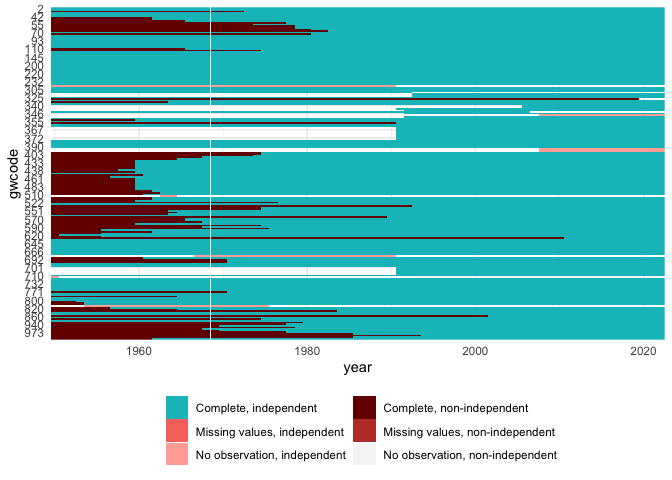<!-- -->

``` r
# Combine pop sources -----------------------------------------------------
```

## Combine and overlap

``` r
ksg2 <- ksg %>%
  rename(gwcode = idnum, pop_ksg = pop, source_ksg = source) %>%
  select(gwcode, year, pop_ksg, source_ksg)
wdi2 <- wdi %>%
  rename(pop_wdi = pop) %>%
  select(gwcode, year, pop_wdi)
un2 <- un %>%
  rename(pop_un = pop) %>%
  select(gwcode, year, pop_un)
joint <- list(ksg2, wdi2, un2) %>%
  purrr::reduce(full_join, by = c("gwcode", "year")) %>%
  tidyr::gather(source, pop, -gwcode, -year, -source_ksg) %>%
  # add an indicator for whether the sources have overlapping coverage
  group_by(gwcode, year) %>%
  mutate(overlap = !any(is.na(pop))) %>%
  ungroup()

joint_wide <- joint %>%
  spread(source, pop)
```

The next plot shows the UN, WDI, and KSG population series for each
country.

``` r
ggplot(joint, aes(x = year, y = pop, group = interaction(gwcode, source),
                  color = source)) +
  geom_line() +
  scale_y_log10() +
  theme_minimal()
```

    ## Warning: Removed 25527 rows containing missing values (`geom_line()`).

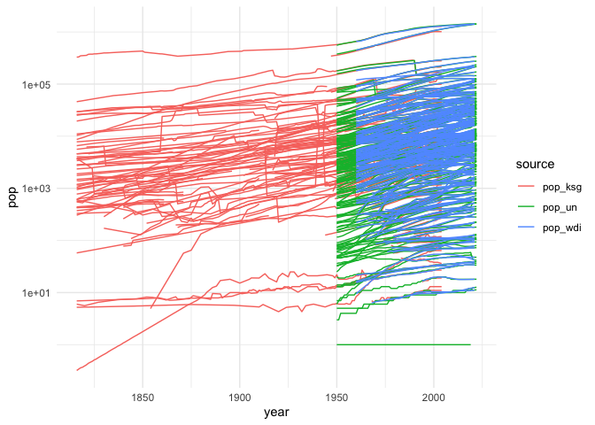<!-- -->

There are quite some divergences. The UN and WDI data seem to generally
be much more smooth than the KSG data, which has sometimes drastic
shifts. I would say the UN values would be preferable where possible,
they are more smooth than WDI and are easier to use to reconstruct
historical state unions like Yugoslavia that are now several states.

Try to sample some series to get a better look.

``` r
countries <- c(2, 260, 344, 345, 365, 436, 540, 645, 651, 678, 710)
joint %>%
  filter(year > 1959) %>%
  filter(gwcode %in% countries) %>%
  left_join(cnames, by = c("gwcode")) %>%
  ggplot(aes(x = year, y = pop, color = source)) +
  facet_wrap(~ country_name, scales = "free_y") +
  geom_line() + 
  theme_minimal()
```

    ## Warning: Removed 80 rows containing missing values (`geom_line()`).

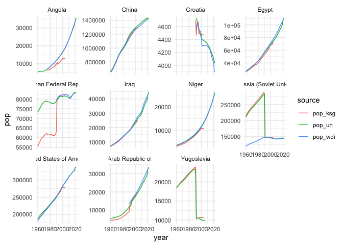<!-- -->

So it seems that UN is generally preferable, except for cases like
Germany before 1990, where historical data were adjusted in WDI to
ignore country changes. There it would be preferable to use KSG.

### Within country covariances between UN and KSG

Check the country correlations.

``` r
cors <- joint %>%
  spread(source, pop) %>%
  group_by(gwcode) %>%
  summarize(cor = tryCatch(
    cor(pop_ksg, pop_un, use = "complete.obs"),
    error = function(e) NA_real_))

ggplot(cors, aes(x = cor)) +
  geom_histogram(binwidth = 0.1) +
  theme_minimal()
```

    ## Warning: Removed 32 rows containing non-finite values (`stat_bin()`).

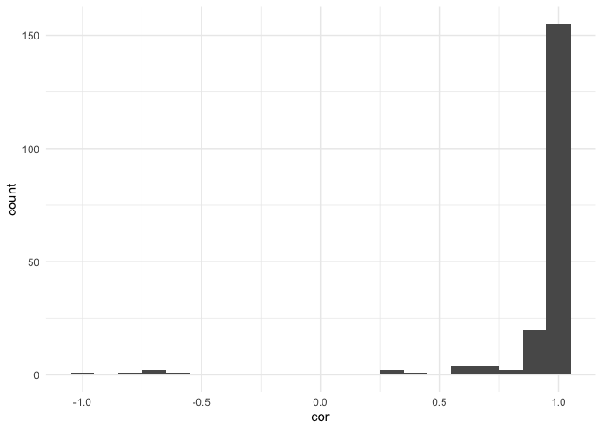<!-- -->

### Countries where UN, KSG, WDI do not agree

Most of them are 0.9 or higher. What about the exceptions?

``` r
countries <- filter(cors, cor < 0.85) %>% pull(gwcode)
joint %>%
  filter(year > 1959) %>%
  filter(gwcode %in% countries) %>%
  left_join(cnames, by = c("gwcode")) %>%
  ggplot(aes(x = year, y = pop, color = source)) +
  facet_wrap(~ country_name, scales = "free_y") +
  geom_line() + 
  theme_minimal()
```

    ## Warning: Removed 19 rows containing missing values (`geom_line()`).

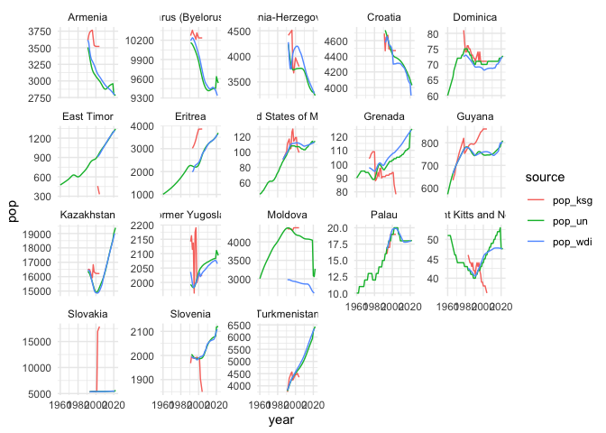<!-- -->

UN seems fine on these except Germany pre-1990, USSR pre-1990, and
Pakistan pre-1971.

### Can we combine KSG for pre-50 with UN?

Check to see how well they are aligned.

``` r
# Only look at countries where GW is meeting UN; UN has too many
weld_countries <- joint %>% 
  filter(year==1949 & source == "pop_ksg") %>%
  pull(gwcode)
weld <- joint %>%
  filter(year > 1945 & year < 1956 & gwcode %in% weld_countries) %>%
  left_join(cnames, by = c("gwcode")) %>%
  filter(source!="pop_wdi") %>%
  spread(source, pop) %>%
  mutate(diff = (pop_ksg - pop_un) / (.5*(pop_ksg+pop_un)))

# Countries with divergence in meeting up year
lookat <- filter(weld, year==1950 & abs(diff) > .05) %>% pull(gwcode)
  
weld %>%
  gather(source, pop, pop_ksg, pop_un) %>%
  filter(gwcode %in% lookat) %>%
  ggplot(., aes(x = year, y = pop, color = source, group = interaction(source, gwcode))) +
  geom_line() + 
  theme_minimal() +
  scale_y_log10()
```

    ## Warning: Removed 110 rows containing missing values (`geom_line()`).

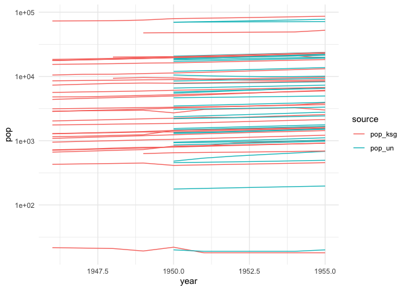<!-- -->

Some divergences greater than 5%, but let’s gloss over those for now.
\## Start imputing/combining

Take UN as the preferable source, but drop in KSG for known deviations
and pre-1950. For Kosovo we use WDI.

``` r
master <- state_panel(1816, max(joint$year), partial = "any") %>%
  mutate(gw = TRUE)
pop <- joint_wide %>%
  mutate(
    pop = case_when(
      year > 1949 ~ pop_un,
      year < 1950 ~ pop_ksg,
      TRUE ~ NA_real_),
    source = case_when(
      year > 1949 ~ "un",
      year < 1950 ~ "ksg",
      TRUE ~ NA_character_)
  ) %>%
  right_join(., master, by = c("gwcode", "year")) %>%
  replace_na(list(gw = FALSE))
```

### Germany

``` r
joint_wide %>%
  filter(gwcode==265 & year > 1985 & year < 1995)
```

    ## # A tibble: 5 × 7
    ##   gwcode  year source_ksg overlap pop_ksg pop_un pop_wdi
    ##    <dbl> <dbl>      <dbl> <lgl>     <dbl>  <dbl>   <dbl>
    ## 1    265  1986          0 FALSE     16624     NA      NA
    ## 2    265  1987          0 FALSE     16641     NA      NA
    ## 3    265  1988          0 FALSE     16666     NA      NA
    ## 4    265  1989          0 FALSE     16630     NA      NA
    ## 5    265  1990          0 FALSE     16247     NA      NA

``` r
## use 1990 and before KSG for Germany
idx <- pop$gwcode==265 & pop$year <= 1990
pop$pop[idx] <- pop$pop_ksg[idx]
pop$source[idx] <- "ksg"
```

### Vietnam

``` r
joint_wide %>%
  filter(gwcode==816 & year > 1970 & year < 1980)
```

    ## # A tibble: 9 × 7
    ##   gwcode  year source_ksg overlap pop_ksg pop_un pop_wdi
    ##    <dbl> <dbl>      <dbl> <lgl>     <dbl>  <dbl>   <dbl>
    ## 1    816  1971          0 FALSE     21595  44484     NA 
    ## 2    816  1972          0 FALSE     22038  45548     NA 
    ## 3    816  1973          0 FALSE     22481  46604     NA 
    ## 4    816  1974          0 FALSE     23244  47658     NA 
    ## 5    816  1975          0 TRUE      24032  48718  46970.
    ## 6    816  1976          0 TRUE      49160  49785  48164.
    ## 7    816  1977          0 TRUE      50413  50861  49418.
    ## 8    816  1978          0 TRUE      51423  51959  50701.
    ## 9    816  1979          0 TRUE      52462  53095  51831.

``` r
## use 1974 and before KSG for DRV
idx <- pop$gwcode==816 & pop$year <= 1974
pop$pop[idx] <- pop$pop_ksg[idx]
pop$source[idx] <- "ksg"


joint_wide %>%
  filter(gwcode==817 & year > 1970 & year < 1980)
```

    ## # A tibble: 5 × 7
    ##   gwcode  year source_ksg overlap pop_ksg pop_un pop_wdi
    ##    <dbl> <dbl>      <dbl> <lgl>     <dbl>  <dbl>   <dbl>
    ## 1    817  1971          0 FALSE     18810     NA      NA
    ## 2    817  1972          0 FALSE     19086     NA      NA
    ## 3    817  1973          0 FALSE     19367     NA      NA
    ## 4    817  1974          0 FALSE     19652     NA      NA
    ## 5    817  1975          0 FALSE     19941     NA      NA

``` r
## use 1975 and before KSG for RV
idx <- pop$gwcode==817 & pop$year <= 1975
pop$pop[idx] <- pop$pop_ksg[idx]
pop$source[idx] <- "ksg"
```

### Yemen

``` r
joint_wide %>%
  filter(gwcode==678 & year > 1985 & year < 1995)
```

    ## # A tibble: 9 × 7
    ##   gwcode  year source_ksg overlap pop_ksg pop_un pop_wdi
    ##    <dbl> <dbl>      <dbl> <lgl>     <dbl>  <dbl>   <dbl>
    ## 1    678  1986          0 FALSE      7911   9941     NA 
    ## 2    678  1987          0 FALSE      8213  10322     NA 
    ## 3    678  1988          0 FALSE      8529  10731     NA 
    ## 4    678  1989          0 FALSE      8857  11189     NA 
    ## 5    678  1990          0 TRUE       9196  11710  13375.
    ## 6    678  1991          0 TRUE      11613  12302  13896.
    ## 7    678  1992          0 TRUE      11952  12954  14434.
    ## 8    678  1993          0 TRUE      12302  13634  14988.
    ## 9    678  1994          0 TRUE      14859  14298  15553.

``` r
## use 1989 and before KSG for north Yemen
idx <- pop$gwcode==678 & pop$year <= 1989
pop$pop[idx] <- pop$pop_ksg[idx]
pop$source[idx] <- "ksg"


joint_wide %>%
  filter(gwcode==680 & year > 1985 & year < 1995)
```

    ## # A tibble: 5 × 7
    ##   gwcode  year source_ksg overlap pop_ksg pop_un pop_wdi
    ##    <dbl> <dbl>      <dbl> <lgl>     <dbl>  <dbl>   <dbl>
    ## 1    680  1986          0 FALSE      2220     NA      NA
    ## 2    680  1987          0 FALSE      2278     NA      NA
    ## 3    680  1988          0 FALSE      2337     NA      NA
    ## 4    680  1989          0 FALSE      2398     NA      NA
    ## 5    680  1990          0 FALSE      2460     NA      NA

``` r
## use KSG for south Yemen
idx <- pop$gwcode==680 & pop$year <= 1990
pop$pop[idx] <- pop$pop_ksg[idx]
pop$source[idx] <- "ksg"
```

### Kosovo

``` r
joint_wide %>%
  filter(gwcode==347 & year > 2006 & year < 2015)
```

    ## # A tibble: 7 × 7
    ##   gwcode  year source_ksg overlap pop_ksg pop_un pop_wdi
    ##    <dbl> <dbl>      <dbl> <lgl>     <dbl>  <dbl>   <dbl>
    ## 1    347  2008         NA FALSE        NA     NA   1747.
    ## 2    347  2009         NA FALSE        NA     NA   1761.
    ## 3    347  2010         NA FALSE        NA     NA   1776.
    ## 4    347  2011         NA FALSE        NA     NA   1791 
    ## 5    347  2012         NA FALSE        NA     NA   1807.
    ## 6    347  2013         NA FALSE        NA     NA   1818.
    ## 7    347  2014         NA FALSE        NA     NA   1813.

``` r
# Get Kosovo series and kalman smooth
idx <- pop$gwcode==347
kos <- pop$pop_wdi[idx]
kos <- imputeTS::na_kalman(kos, "auto.arima")
pop$pop[idx] <- kos
pop$source[idx] <- "wdi"
```

### Tibet

Tibet is missing in UN data, so use KSG as with 1949 and before.

``` r
joint_wide %>%
  filter(gwcode==711 & year > 1945 & year < 1955)
```

    ## # A tibble: 5 × 7
    ##   gwcode  year source_ksg overlap pop_ksg pop_un pop_wdi
    ##    <dbl> <dbl>      <dbl> <lgl>     <dbl>  <dbl>   <dbl>
    ## 1    711  1946          2 FALSE     1708.     NA      NA
    ## 2    711  1947          1 FALSE     1700      NA      NA
    ## 3    711  1948          2 FALSE     1651.     NA      NA
    ## 4    711  1949          2 FALSE     1604.     NA      NA
    ## 5    711  1950          2 FALSE     1558.     NA      NA

``` r
# Use KSG for 1950 as well
idx <- pop$gwcode==711 & pop$year == 1950
pop$pop[idx] <- pop$pop_ksg[idx]
pop$source[idx] <- "ksg"
```

### Czechoslovakia

Missing first year (1918), backwards impute.

``` r
joint_wide %>%
  filter(gwcode==315 & year < 1921)
```

    ## # A tibble: 2 × 7
    ##   gwcode  year source_ksg overlap pop_ksg pop_un pop_wdi
    ##    <dbl> <dbl>      <dbl> <lgl>     <dbl>  <dbl>   <dbl>
    ## 1    315  1919          0 FALSE     13398     NA      NA
    ## 2    315  1920          0 FALSE     13530     NA      NA

``` r
pop %>% 
  filter(gwcode==315 & year < 1921)
```

    ## # A tibble: 3 × 10
    ##   gwcode  year source_ksg overlap pop_ksg pop_un pop_wdi   pop source gw   
    ##    <dbl> <dbl>      <dbl> <lgl>     <dbl>  <dbl>   <dbl> <dbl> <chr>  <lgl>
    ## 1    315  1919          0 FALSE     13398     NA      NA 13398 ksg    TRUE 
    ## 2    315  1920          0 FALSE     13530     NA      NA 13530 ksg    TRUE 
    ## 3    315  1918         NA NA           NA     NA      NA    NA <NA>   TRUE

Plot the pop series:

``` r
idx <- pop$gwcode==315
csk <- pop$pop_ksg[idx]
plot(pop$year[idx], csk)
```

<!-- -->

It is quite jumpy, so use only pre-1937

``` r
idx2 <- pop$gwcode==315 & pop$year <= 1937
csk  <- pop$pop_ksg[idx2]
csk  <- rev(imputeTS::na.kalman(rev(csk), "auto.arima"))
```

    ## Warning: na.kalman will be replaced by na_kalman.
    ##     Functionality stays the same.
    ##     The new function name better fits modern R code style guidelines.
    ##     Please adjust your code accordingly.

``` r
pop$pop[idx2]   <- csk
pop$source[idx2] <- "ksg"

# Verify via plot
idx <- pop$gwcode==315
csk <- pop$pop[idx]
plot(pop$year[idx], csk)
```

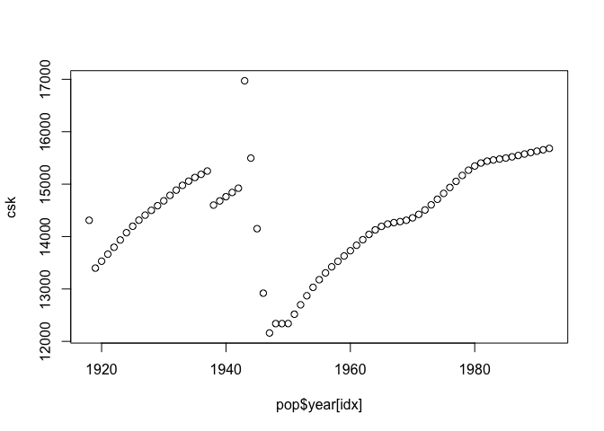<!-- -->

``` r
# Prepare to write out data -----------------------------------------------
```

## Get ready to write final data

### Check values for splitting/joining countries

``` r
countries <- c(260, 265, 
               345, 340, 341, 343, 344, 346, 347, 349, 
               816, 817,
               678, 680,
               365, 366, 367, 368)
pop %>%
  filter(gwcode %in% countries) %>%
  left_join(cnames, by = c("gwcode")) %>%
  ggplot(aes(x = year, y = pop)) +
  facet_wrap(~ country_name, scales = "free", ncol = 4) +
  geom_line() + 
  theme_minimal()
```

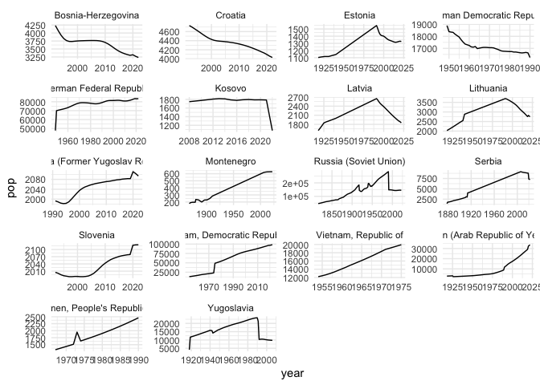<!-- -->

### Missingness

``` r
plot_missing(pop, x = "pop", ccode = "gwcode", time = "year", statelist = "GW")
```

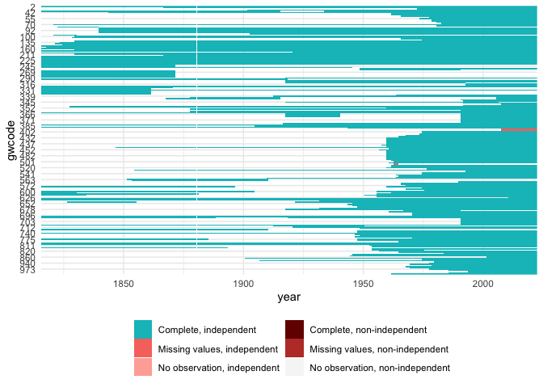<!-- -->

The final data is complete for 1950 to 2019, except for Abkhazia, South
Ossetia, and Zanzibar.

``` r
pop %>%
  filter(is.na(pop)) %>%
  group_by(gwcode) %>%
  summarize(years = paste0(range(year), collapse = " - "), N = n()) %>%
  mutate(country_name = country_names(gwcode)) %>%
  knitr::kable()
```

<table>
<thead>
<tr>
<th style="text-align:right;">
gwcode
</th>
<th style="text-align:left;">
years
</th>
<th style="text-align:right;">
N
</th>
<th style="text-align:left;">
country_name
</th>
</tr>
</thead>
<tbody>
<tr>
<td style="text-align:right;">
396
</td>
<td style="text-align:left;">
2008 - 2022
</td>
<td style="text-align:right;">
15
</td>
<td style="text-align:left;">
Abkhazia
</td>
</tr>
<tr>
<td style="text-align:right;">
397
</td>
<td style="text-align:left;">
2008 - 2022
</td>
<td style="text-align:right;">
15
</td>
<td style="text-align:left;">
South Ossetia
</td>
</tr>
<tr>
<td style="text-align:right;">
511
</td>
<td style="text-align:left;">
1963 - 1964
</td>
<td style="text-align:right;">
2
</td>
<td style="text-align:left;">
Zanzibar
</td>
</tr>
</tbody>
</table>

``` r
pop %>%
  select(gwcode, year, pop) %>%
  write_csv(., path = "output/population.csv")


setwd(oldwd)
```
