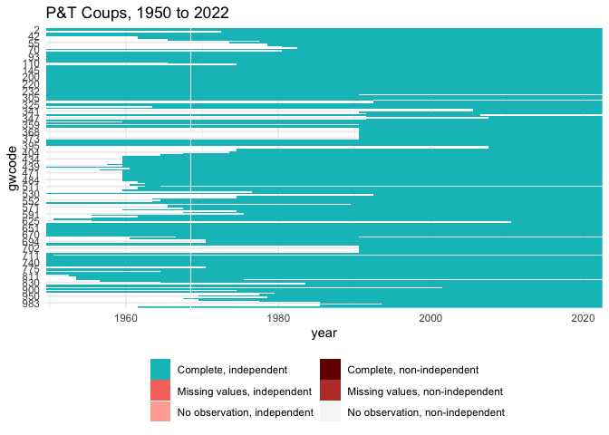

P&T Coups
================

*Last updated on 2022-02-19*

Coup data-derived indicators for 1950 to the present.

## Usage

``` r
suppressPackageStartupMessages({
  library(dplyr)
  library(readr)
  library(states)
  library(ggplot2)
  library(tibble)
})

coups <- read_csv("output/ptcoups.csv")
```

    ## Rows: 11793 Columns: 20

    ## ── Column specification ────────────────────────────────────────────────────────
    ## Delimiter: ","
    ## dbl (20): gwcode, year, pt_attempt, pt_attempt_num, pt_coup_num, pt_coup, pt...

    ## 
    ## ℹ Use `spec()` to retrieve the full column specification for this data.
    ## ℹ Specify the column types or set `show_col_types = FALSE` to quiet this message.

``` r
attr(coups, "spec") <- NULL

glimpse(coups)
```

    ## Rows: 11,793
    ## Columns: 20
    ## $ gwcode                      <dbl> 2, 2, 2, 2, 2, 2, 2, 2, 2, 2, 2, 2, 2, 2, …
    ## $ year                        <dbl> 1950, 1951, 1952, 1953, 1954, 1955, 1956, …
    ## $ pt_attempt                  <dbl> 0, 0, 0, 0, 0, 0, 0, 0, 0, 0, 0, 0, 0, 0, …
    ## $ pt_attempt_num              <dbl> 0, 0, 0, 0, 0, 0, 0, 0, 0, 0, 0, 0, 0, 0, …
    ## $ pt_coup_num                 <dbl> 0, 0, 0, 0, 0, 0, 0, 0, 0, 0, 0, 0, 0, 0, …
    ## $ pt_coup                     <dbl> 0, 0, 0, 0, 0, 0, 0, 0, 0, 0, 0, 0, 0, 0, …
    ## $ pt_failed_num               <dbl> 0, 0, 0, 0, 0, 0, 0, 0, 0, 0, 0, 0, 0, 0, …
    ## $ pt_failed                   <dbl> 0, 0, 0, 0, 0, 0, 0, 0, 0, 0, 0, 0, 0, 0, …
    ## $ pt_coup_total               <dbl> 0, 0, 0, 0, 0, 0, 0, 0, 0, 0, 0, 0, 0, 0, …
    ## $ pt_failed_total             <dbl> 0, 0, 0, 0, 0, 0, 0, 0, 0, 0, 0, 0, 0, 0, …
    ## $ pt_attempt_total            <dbl> 0, 0, 0, 0, 0, 0, 0, 0, 0, 0, 0, 0, 0, 0, …
    ## $ pt_coup_num5yrs             <dbl> 0, 0, 0, 0, 0, 0, 0, 0, 0, 0, 0, 0, 0, 0, …
    ## $ pt_failed_num5yrs           <dbl> 0, 0, 0, 0, 0, 0, 0, 0, 0, 0, 0, 0, 0, 0, …
    ## $ pt_attempt_num5yrs          <dbl> 0, 0, 0, 0, 0, 0, 0, 0, 0, 0, 0, 0, 0, 0, …
    ## $ pt_coup_num10yrs            <dbl> 0, 0, 0, 0, 0, 0, 0, 0, 0, 0, 0, 0, 0, 0, …
    ## $ pt_failed_num10yrs          <dbl> 0, 0, 0, 0, 0, 0, 0, 0, 0, 0, 0, 0, 0, 0, …
    ## $ pt_attempt_num10yrs         <dbl> 0, 0, 0, 0, 0, 0, 0, 0, 0, 0, 0, 0, 0, 0, …
    ## $ years_since_last_pt_coup    <dbl> 1, 2, 3, 4, 5, 6, 7, 8, 9, 10, 11, 12, 13,…
    ## $ years_since_last_pt_failed  <dbl> 1, 2, 3, 4, 5, 6, 7, 8, 9, 10, 11, 12, 13,…
    ## $ years_since_last_pt_attempt <dbl> 1, 2, 3, 4, 5, 6, 7, 8, 9, 10, 11, 12, 13,…

``` r
range(coups$year)
```

    ## [1] 1950 2022

``` r
plot_missing(coups, colnames(coups)[3:10], "gwcode", "year", "year", "GW") +
  ggtitle(sprintf("P&T Coups, %s to %s", min(coups$year), max(coups$year)))
```

<!-- -->

``` r
cor(coups[, 3:ncol(coups)]) %>%
  as_tibble() %>%
  mutate(var1 = colnames(.)) %>%
  tidyr::pivot_longer(-c(var1), names_to = "var2") %>%
  ggplot(aes(x = var1, y = var2, fill = value)) +
  geom_tile() +
  scale_fill_gradient2("Correlation", limits = c(-1, 1)) +
  theme_bw() +
  theme(axis.text.x = element_text(angle = 45, hjust = 1)) +
  labs(x = "", y = "")
```

<!-- -->
