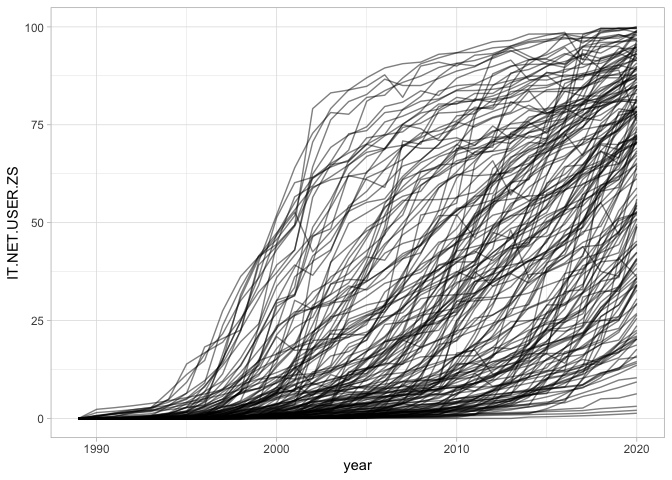
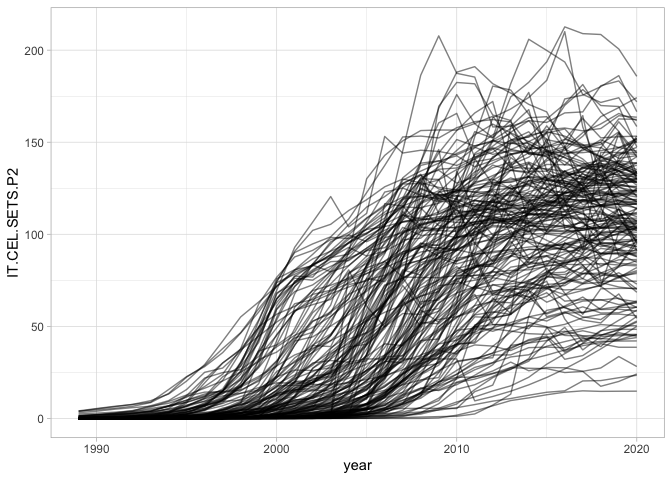

WDI: ICT
================

*Last updated on: 23 February 2022*

Cell phone and internet broadband usage rates.

``` r
library(ggplot2)

df <- read.csv("output/wdi-ict.csv")
dplyr::glimpse(df)
```

    ## Rows: 10,615
    ## Columns: 7
    ## $ gwcode                 <int> 2, 2, 2, 2, 2, 2, 2, 2, 2, 2, 2, 2, 2, 2, 2, 2,…
    ## $ year                   <int> 1960, 1961, 1962, 1963, 1964, 1965, 1966, 1967,…
    ## $ country                <chr> "United States", "United States", "United State…
    ## $ IT.NET.USER.ZS         <dbl> 0, 0, 0, 0, 0, 0, 0, 0, 0, 0, 0, 0, 0, 0, 0, 0,…
    ## $ IT.NET.USER.ZS_imputed <lgl> TRUE, TRUE, TRUE, TRUE, TRUE, TRUE, TRUE, TRUE,…
    ## $ IT.CEL.SETS.P2         <dbl> 0.00000000, 0.00000000, 0.00000000, 0.00000000,…
    ## $ IT.CEL.SETS.P2_imputed <lgl> FALSE, TRUE, TRUE, TRUE, TRUE, FALSE, TRUE, TRU…

``` r
stats <- yaml::read_yaml("output/wdi-ict-signature.yml")
stats
```

    ## $Class
    ## [1] "tbl_df, tbl, data.frame"
    ## 
    ## $Size_in_mem
    ## [1] "0.5 Mb"
    ## 
    ## $N_countries
    ## [1] 175
    ## 
    ## $Years
    ## [1] "1960 - 2020"
    ## 
    ## $N_columns
    ## [1] 7
    ## 
    ## $Columns
    ## [1] "gwcode, year, country, IT.NET.USER.ZS, IT.NET.USER.ZS_imputed, IT.CEL.SETS.P2, IT.CEL.SETS.P2_imputed"
    ## 
    ## $N_rows
    ## [1] 10615
    ## 
    ## $N_complete_rows
    ## [1] 10615

``` r
ggplot(df[df$year > 1988, ], aes(x = year, y = IT.NET.USER.ZS, group = gwcode)) +
  geom_line(alpha = 0.5) +
  theme_light()
```

<!-- -->

``` r
# Scaled version that is adjusted for annual mean and sd
ggplot(df[df$year > 1988, ], aes(x = year, y = IT.CEL.SETS.P2, group = gwcode)) +
  geom_line(alpha = 0.5) +
  theme_light()
```

<!-- -->

## Data cleaning

See [clean-data.md](clean-data.md) for results of the data cleaning
script.
