WDI ICT (Internet and mobile use)
================

-   [Explore possible indicators](#explore-possible-indicators)
-   [Get raw data](#get-raw-data)
-   [Imputation](#imputation)
    -   [Impute internet users](#impute-internet-users)
    -   [Impute cell phone rates](#impute-cell-phone-rates)
-   [Done, save](#done-save)

*Last updated on: 23 February 2022*

``` r
suppressPackageStartupMessages({
  library(WDI)
  library(dplyr)
  library(lubridate)
  library(readr)
  library(tidyr)
  library(purrr)
  library(ggplot2)
  library(nlme)
  library(states)
})

if (FALSE) {
  library("WDI")
library("dplyr")
library("purrr")
library("ggplot2")
library("lubridate")
library("nlme")  # model cell phone growth curves
library("zoo")
library("forecast")
library("broom")
library("states")
library("readr")
library("datamodules")
library("stringr")
library("tidyr")
}


wdi_to_gw <- function(x, iso2c = "iso2c", country = "country", year = "year") {
  
  # In case the ID columns don't match the WDI default, create them here. 
  # dplyr is easier to use when we can refer to these columns directly
  x$iso2c   <- x[[iso2c]]
  x$country <- x[[country]]
  x$year    <- x[[year]]
  
  # remove non-state entities, i.e. regions and aggregates
  notstate <- c("1A", "1W", "4E", "7E", "8S", "B8", "F1", "S1", "S2", "S3", "S4",
                "T2", "T3", "T4", "T5", "T6", "T7", "V1", "V2", "V3", "V4", "Z4",
                "Z7", "EU", "OE", "XC", "XD", "XE", "XF", "XG", "XH", "XI", "XJ",
                "XL", "XM", "XN", "XO", "XP", "XQ", "XT", "XU", "XY", "ZF", "ZG",
                "ZJ", "ZQ", "ZT")
  x <- x %>%
    dplyr::filter(!iso2c %in% notstate) 
  
  # first pass G&W country code coding
  x$gwcode <- suppressWarnings(countrycode::countrycode(x[["iso2c"]], "iso2c", "gwn"))
  x$gwcode <- as.integer(x$gwcode)

  # this misses some countries; first the fixed, non-year-varying, cases
  x <- x %>%
    mutate(
      gwcode = case_when(
        iso2c=="AD" ~ 232L,
        iso2c=="XK" ~ 347L,
        country=="Namibia" ~ 565L,
        iso2c=="VN" ~ 816L,  # countrycode uses 817, South Vietnam for this
        iso2c=="YE" ~ 678L,  # Yemen
        TRUE ~ gwcode
      )
    )

  # Fix Serbia/Yugoslavia
  # Right now all coded as 340, but in G&W 345 (Yugo) ends in 2006 and 
  # 340 (Serbia) starts
  serbia2006 <- x[x$gwcode==340 & x$year==2006 & !is.na(x$gwcode), ]
  yugo_idx <- x$gwcode==340 & x$year < 2007 & !is.na(x$gwcode)
  x$gwcode[yugo_idx]  <- 345
  x$iso2c[yugo_idx]   <- "YU"
  x$country[yugo_idx] <- "Yugoslavia/Serbia & Montenegro"
  x <- bind_rows(x, serbia2006) %>%
    arrange(gwcode, iso2c, country, year)
  
  x
}

# If first non-missing value is <t, set preceding to 0
zero_backcode <- function(x, t) {
  if (length(x) > 1) {
    for (i in length(x):2) {
      if (!is.na(x[i]) & x[i] < t & (is.na(x[i-1]) | x[i-1]==0)) x[i-1] <- 0
    }
  }
  x
}


lgc_impute <- function(y, year) {
  df <- tibble(y = y, year = year, t = year - min(year))
  
  # Set values before 1990 to 0
  df[df$year < 1990 & is.na(df$y), "y"] <- 0
  
  # If the first non-missing, > 0 values is very small, set preceding values
  # also to 0; y scale is 0 to 100, use .2
  df$y <- zero_backcode(df$y, .2)
  
  # Attempt to apply logistic growth curve model
  # First, get estimate for starting values
  init <- tryCatch({
    df_gt0  <- filter(df, !is.na(y) & y > 0)
    fit_init <- nls(y ~ SSlogis(year, Asym, xmid, scal), data = df_gt0)
    coef(fit_init)[c("xmid", "scal")]
  }, error = function(e) {
    # revert to dummy starting values
    c("xmid" = 2020, "scal" = 4)
  })
  tryCatch({
    df_nmy <- filter(df, !is.na(y))
    fit <- nlme::gnls(y ~ 100 / (1 + exp((xmid - year) / scal)),
                      data = df_nmy, start = init)
    df$y[is.na(df$y)] <- predict(fit, newdata = df[is.na(df$y), ])
  }, error = function(e) {
    NULL
  })
  
  df$y
}

# logistic growth curve imputer for cell phones per 1,000
lgc_impute_cell <- function(y, year) {
  df <- tibble(y = y, year = year, t = year - min(year))
  
  # Set values before 1990 to 0
  df[df$year < 1990 & is.na(df$y), "y"] <- 0
  
  # If the first non-missing, > 0 values is very small, set preceding values
  # also to 0; y scale is 0 to 100, use .2
  df$y <- zero_backcode(df$y, .2)
  
  # Attempt to apply logistic growth curve model
  # First, get estimate for starting values
  init <- tryCatch({
    df_gt0  <- filter(df, !is.na(y) & y > 0)
    fit_init <- nls(y ~ SSlogis(year, Asym, xmid, scal), data = df_gt0)
    coef(fit_init)
  }, error = function(e) {
    # revert to dummy starting values
    c("Asym" = 100, "xmid" = 2020, "scal" = 4)
  })
  tryCatch({
    df_nmy <- filter(df, !is.na(y))
    fit <- nlme::gnls(y ~ Asym / (1 + exp((xmid - year) / scal)),
                      data = df_nmy, start = init,
                      control = nlmeControl(niterEM = 50, pnlsTol = 0.001))
    df$y[is.na(df$y)] <- predict(fit, newdata = df[is.na(df$y), ])
  }, error = function(e) {
    NULL
  })
  # If still remaining NA's, try to fall back to model with init values
  if (any(is.na(df$y))) {
    tryCatch({
      yhat <- init["Asym"] / (1 + exp((init["xmid"] - df$year) / init["scal"]))
      df$y[is.na(df$y)] <- yhat[is.na(df$y)]
    }, error = function(e) {
      NULL
    })
  }
  
  df$y
}
```

## Explore possible indicators

``` r
ind <- c("IT.CEL", "IT.NET")
vars <- ind %>% 
  map_df(function(x) {
    as_tibble(WDIsearch(x, field = "indicator"))
    }) 

cfh <- "input/ict_all_vars_cache.rds"
if (!file.exists(cfh)) {
  all_vars <- WDI(country = "all", indicator = vars$indicator,
                start = 1960, end = year(today()), extra = FALSE) 
  write_rds(all_vars, path = cfh)
} else {
  all_vars <- read_rds(cfh)
}

sum_vars <- all_vars %>%
  select(-iso2c, -country, -year) %>%
  gather(var, value) %>%
  group_by(var) %>%
  summarize_all(funs(N = n(), N_missing = sum(is.na(.)))) %>%
  ungroup() %>%
  mutate(Frac_missing = N_missing/N) %>%
  left_join(vars, ., by = c("indicator" = "var"))

sum_vars %>%
  arrange(Frac_missing) %>%
  knitr::kable(digits = 2)
```

## Get raw data

Download the raw source data. Since this takes a while, this will only
raw if a copy of the source data is not present in the input folder.

*UPDATE: To trigger and update, delete the raw data input file or
manually run this chunk.*

``` r
if (!file.exists("input/ict.csv")) {
  raw <- WDI(indicator = c("IT.CEL.SETS.P2", "IT.NET.USER.ZS"), 
             country = "all", start = 1960, 
             end = year(today()), extra = FALSE)
  write_csv(raw, "input/ict.csv")
}
```

``` r
raw <- read_csv("input/ict.csv")
```

    ## Rows: 16226 Columns: 5

    ## ── Column specification ────────────────────────────────────────────────────────
    ## Delimiter: ","
    ## chr (2): iso2c, country
    ## dbl (3): year, IT.CEL.SETS.P2, IT.NET.USER.ZS

    ## 
    ## ℹ Use `spec()` to retrieve the full column specification for this data.
    ## ℹ Specify the column types or set `show_col_types = FALSE` to quiet this message.

``` r
# UPDATE: manually check to make sure that data for the last year are not all
# missing. 
last_year <- filter(raw, year==max(year))
stopifnot(!all(is.na(last_year[["IT.CEL.SETS.P2"]])))
stopifnot(!all(is.na(last_year[["IT.NET.USER.ZS"]])))
#raw <- filter(raw, year!=max(year))

wdi <- raw %>%
  wdi_to_gw(.) %>%
  arrange(gwcode, year)

# Some minor countries don't have G&W codes
nogwcode <- wdi %>%
  filter(is.na(gwcode)) %>%
  group_by(iso2c, country) %>%
  count() 
write_csv(nogwcode, "output/missing-gwcode.csv")
knitr::kable(nogwcode)
```

| iso2c | country                        |   n |
|:------|:-------------------------------|----:|
| AG    | Antigua and Barbuda            |  61 |
| AS    | American Samoa                 |  61 |
| AW    | Aruba                          |  61 |
| BM    | Bermuda                        |  61 |
| CW    | Curacao                        |  61 |
| DM    | Dominica                       |  61 |
| FM    | Micronesia, Fed. Sts.          |  61 |
| FO    | Faroe Islands                  |  61 |
| GD    | Grenada                        |  61 |
| GI    | Gibraltar                      |  61 |
| GL    | Greenland                      |  61 |
| GU    | Guam                           |  61 |
| HK    | Hong Kong SAR, China           |  61 |
| IM    | Isle of Man                    |  61 |
| JG    | Channel Islands                |  61 |
| KI    | Kiribati                       |  61 |
| KN    | St. Kitts and Nevis            |  61 |
| KY    | Cayman Islands                 |  61 |
| LC    | St. Lucia                      |  61 |
| LI    | Liechtenstein                  |  61 |
| MC    | Monaco                         |  61 |
| MF    | St. Martin (French part)       |  61 |
| MH    | Marshall Islands               |  61 |
| MO    | Macao SAR, China               |  61 |
| MP    | Northern Mariana Islands       |  61 |
| NC    | New Caledonia                  |  61 |
| NR    | Nauru                          |  61 |
| PF    | French Polynesia               |  61 |
| PR    | Puerto Rico                    |  61 |
| PS    | West Bank and Gaza             |  61 |
| PW    | Palau                          |  61 |
| SC    | Seychelles                     |  61 |
| SM    | San Marino                     |  61 |
| ST    | Sao Tome and Principe          |  61 |
| SX    | Sint Maarten (Dutch part)      |  61 |
| TC    | Turks and Caicos Islands       |  61 |
| TO    | Tonga                          |  61 |
| TV    | Tuvalu                         |  61 |
| VC    | St. Vincent and the Grenadines |  61 |
| VG    | British Virgin Islands         |  61 |
| VI    | Virgin Islands (U.S.)          |  61 |
| VU    | Vanuatu                        |  61 |
| WS    | Samoa                          |  61 |
| ZH    | Africa Eastern and Southern    |  61 |
| ZI    | Africa Western and Central     |  61 |

``` r
# Take those out
wdi <- wdi %>%
  dplyr::filter(!is.na(gwcode))
wdi$iso2c <- NULL
```

Visualize series:

``` r
wdi %>%
  pivot_longer(-c(gwcode, year, country), names_to = "var") %>%
  filter(!is.na(value)) %>%
  ggplot(., aes(x = year, y = value)) +
  facet_wrap(~ var, scales = "free_y", ncol = 1) +
  geom_line(aes(group = factor(gwcode)), alpha = 0.2) +
  scale_colour_discrete(guide = FALSE) +
  theme_minimal() +
  geom_smooth(se = FALSE)
```

    ## `geom_smooth()` using method = 'gam' and formula 'y ~ s(x, bs = "cs")'

    ## Warning: It is deprecated to specify `guide = FALSE` to remove a guide. Please
    ## use `guide = "none"` instead.

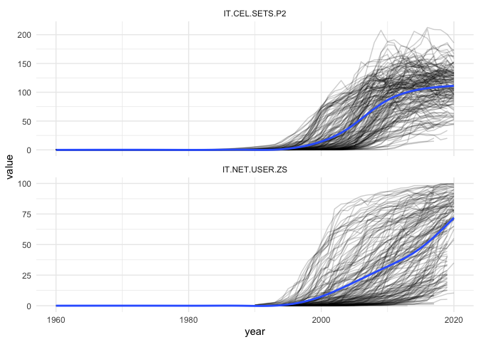<!-- -->

## Imputation

### Impute internet users

First non-zero values are in 1990.

``` r
table(is.na(wdi$IT.NET.USER.ZS))
```

    ## 
    ## FALSE  TRUE 
    ##  5076  5539

1.  Set values before 1990 to 0.
2.  If the first non-zero value is 0.2 or below, set all preceding
    values to 0.
3.  Attempt to fit a logistic growth curve model and use it to impute
    missing values; default starts with midpoint 2020 and scale 4.

This is sufficient to fill in all missing values, but probably is not a
good solution for completely missing countries, like Kosovo.

``` r
wdi2 <- wdi %>%
  dplyr::group_by(gwcode) %>%
  dplyr::mutate(
    IT.NET.USER.ZS_imputed_values = lgc_impute(IT.NET.USER.ZS, year),
    IT.NET.USER.ZS_imputed = is.na(IT.NET.USER.ZS) & 
      !is.na(IT.NET.USER.ZS_imputed_values))

missing <- wdi2 %>%
  group_by(gwcode) %>%
  dplyr::summarize(N = n(), N_miss = sum(is.na(IT.NET.USER.ZS_imputed_values)),
                   Frac_miss = N_miss / N)
sum(missing$N_miss)
```

    ## [1] 0

``` r
# UPDATE: no missing values, is this still the case?

# Check for how many points were imputed, so we can spot check some series
# Only for post 1989, since before that we set all or most values to 0 
imp <- wdi2 %>%
  filter(year > 1989) %>%
  group_by(gwcode) %>%
  summarize(years = n(),
            imputed = sum(IT.NET.USER.ZS_imputed),
            frac_imputed = imputed/years) %>%
  arrange(desc(frac_imputed))
knitr::kable(head(imp, 10), digits = 2)
```

| gwcode | years | imputed | frac_imputed |
|-------:|------:|--------:|-------------:|
|    347 |    31 |      29 |         0.94 |
|    626 |    31 |      26 |         0.84 |
|    345 |    17 |      14 |         0.82 |
|    341 |    31 |      14 |         0.45 |
|    500 |    31 |      13 |         0.42 |
|    625 |    31 |      10 |         0.32 |
|    700 |    31 |      10 |         0.32 |
|    232 |    31 |       9 |         0.29 |
|    775 |    31 |       9 |         0.29 |
|    860 |    31 |       9 |         0.29 |

Check some of the high imputation series:

``` r
check <- c(347, 626, 345, 341, 500, 700)
col <- c("blue", "red")
for (gw in check) {
  title <- states::country_names(gw, shorten = TRUE)
  wdi2 %>%
    filter(year > 1989) %>%
    filter(gwcode==gw) %>%
    with(., plot(year, IT.NET.USER.ZS_imputed_values, 
                 col = col[IT.NET.USER.ZS_imputed + 1],
                 main = title, xlab = "", ylab = "", ylim = c(0, 100)))
  legend(x = 1991, y = 95, col = col, lty = 1, legend = c("Orig", "Imputed"))
}
```

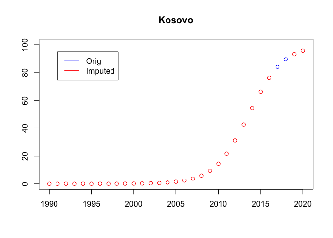<!-- -->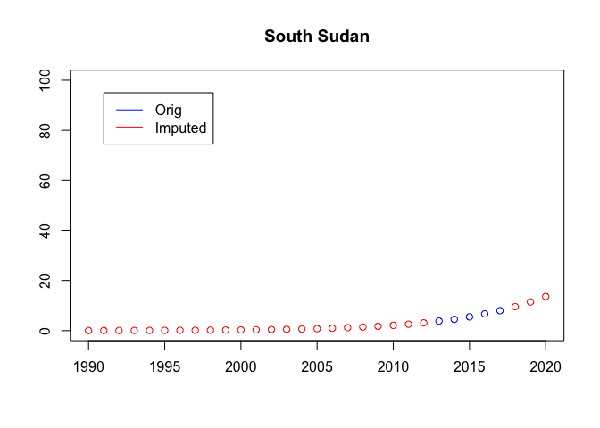<!-- -->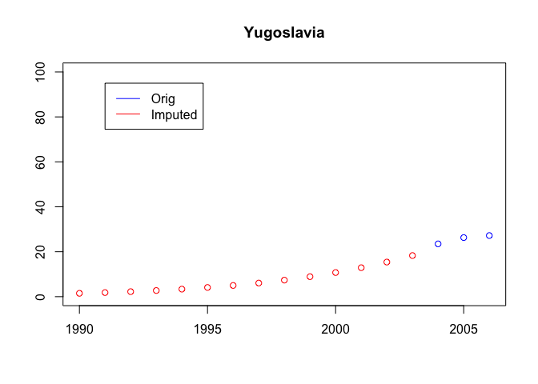<!-- -->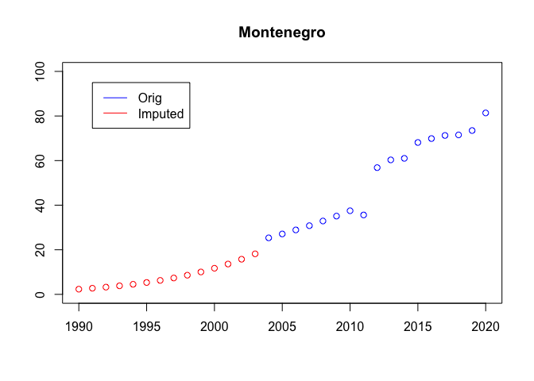<!-- -->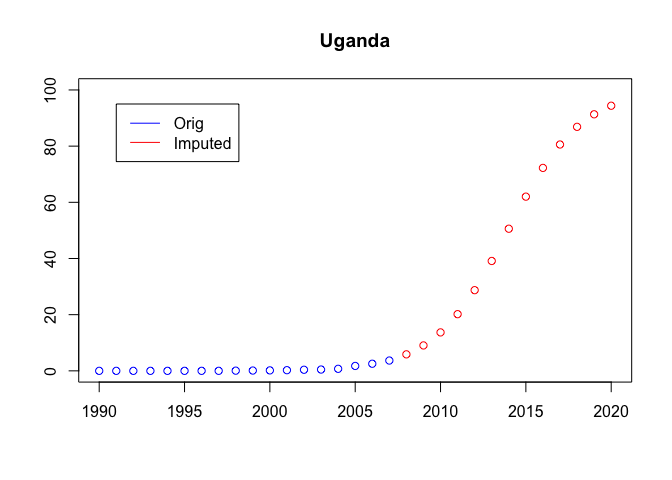<!-- -->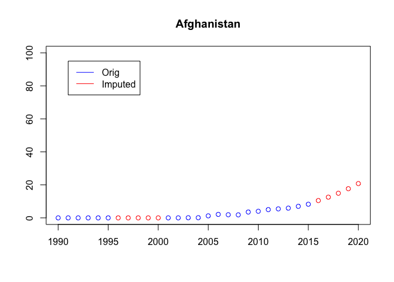<!-- -->

Looks good, replace the original values with the imputed version.

``` r
wdi <- wdi2 %>%
  dplyr::mutate(IT.NET.USER.ZS = IT.NET.USER.ZS_imputed_values,
                IT.NET.USER.ZS_imputed_values = NULL) 
```

### Impute cell phone rates

This is slightly harder because we cannot assume an asymptote of 100,
and even though theoretically it is 1000 (since it is rate per 1000), in
practice it seems to be much lower.

``` r
table(is.na(wdi$IT.CEL.SETS.P2))
```

    ## 
    ## FALSE  TRUE 
    ##  8197  2418

This is the first approach, which sets cell users before 1980 to 0, and
then applied the logistic growth curve model to each individual series.
This does not work in all cases. I’m guessing because some of the series
only fill in the first, early part of a growth curve.

``` r
wdi2 <- wdi

wdi2 <- wdi2 %>% 
  select(gwcode, year, IT.CEL.SETS.P2)

wdi2 <- wdi2 %>%
  dplyr::group_by(gwcode) %>%
  arrange(year) %>%
  dplyr::mutate(
    IT.CEL.SETS.P2_imputed_values = lgc_impute_cell(IT.CEL.SETS.P2, year),
    IT.CEL.SETS.P2_imputed = is.na(IT.CEL.SETS.P2) & 
      !is.na(IT.CEL.SETS.P2_imputed_values))
```

Checkpoint: how many NA’s remaining?

``` r
table(is.na(wdi2$IT.CEL.SETS.P2_imputed_values))
```

    ## 
    ## FALSE 
    ## 10615

``` r
missing <- wdi2 %>%
  filter(is.na(IT.CEL.SETS.P2_imputed_values)) %>%
  group_by(gwcode) %>%
  dplyr::summarize(N_miss = n(), years = paste0(range(year), collapse = " - "))
```

    ## Warning in min(x): no non-missing arguments to min; returning Inf

    ## Warning in max(x): no non-missing arguments to max; returning -Inf

``` r
knitr::kable(missing)
```

| gwcode | N_miss | years |
|-------:|-------:|:------|

``` r
# UPDATE: none are missing, make sure this is still the case

# Check how many data points were imputed and spot check a vew series based on that
imp <- wdi2 %>%
  filter(year > 1989) %>%
  group_by(gwcode) %>%
  summarize(years = n(),
            imputed = sum(IT.CEL.SETS.P2_imputed),
            frac_imputed = imputed/years) %>%
  arrange(desc(frac_imputed))
knitr::kable(head(imp, 10), digits = 2)
```

| gwcode | years | imputed | frac_imputed |
|-------:|------:|--------:|-------------:|
|    345 |    17 |      14 |         0.82 |
|    347 |    31 |      25 |         0.81 |
|    626 |    31 |      21 |         0.68 |
|    341 |    31 |      14 |         0.45 |
|    860 |    31 |      12 |         0.39 |
|    110 |    31 |       3 |         0.10 |
|    436 |    31 |       3 |         0.10 |
|    450 |    31 |       3 |         0.10 |
|    451 |    31 |       3 |         0.10 |
|    484 |    31 |       3 |         0.10 |

Check some of the high imputation series:

``` r
check <- c(345, 347, 626, 341, 860, 110)
col <- c("blue", "red")
for (gw in check) {
  title <- states::country_names(gw, shorten = TRUE)
  wdi2 %>%
    filter(year > 1989) %>%
    filter(gwcode==gw) %>%
    with(., plot(year, IT.CEL.SETS.P2_imputed_values, 
                 col = col[IT.CEL.SETS.P2_imputed + 1],
                 main = title, xlab = "", ylab = "", ylim = c(0, 250)))
  legend(x = 1991, y = 95, col = col, lty = 1, legend = c("Orig", "Imputed"))
}
```

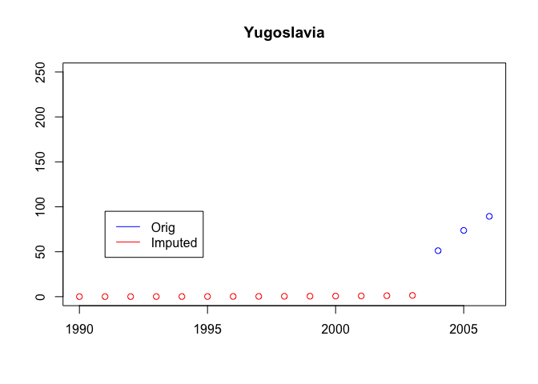<!-- -->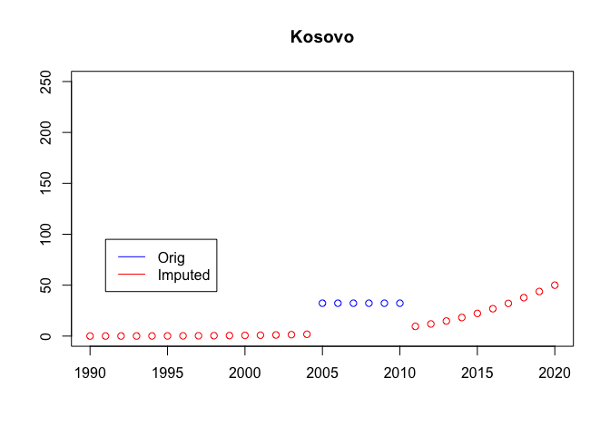<!-- -->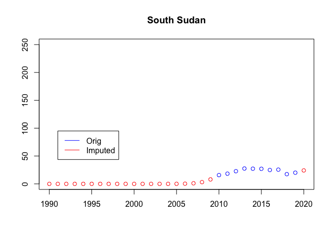<!-- -->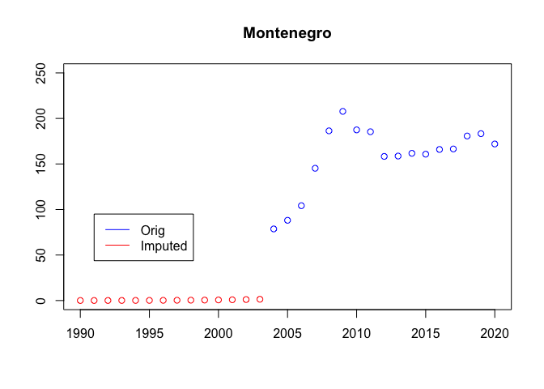<!-- -->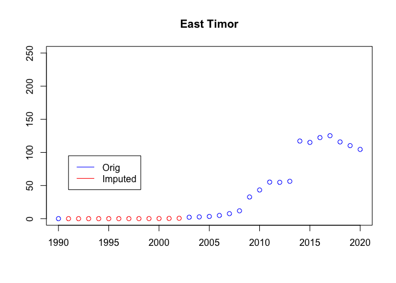<!-- -->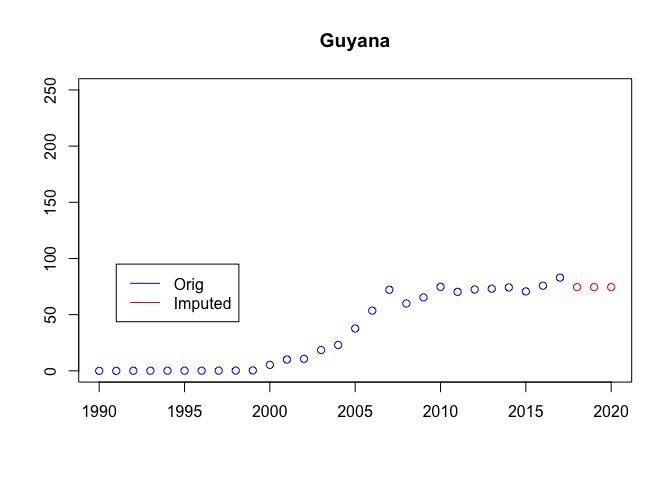<!-- -->

Not that great, but some of these series are just weird.

``` r
wdi <- wdi %>%
  mutate(IT.CEL.SETS.P2 = NULL) %>%
  left_join(wdi2, by = c("gwcode", "year")) %>%
  mutate(IT.CEL.SETS.P2 = IT.CEL.SETS.P2_imputed_values,
         IT.CEL.SETS.P2_imputed_values = NULL)
```

## Done, save

``` r
wdi <- wdi %>%
  ungroup() %>%
  select(gwcode, year, everything())

# Keep a summary of the data so changes in the future are easier to track on 
# git
df <- wdi
stats <- list(
  Class           = paste0(class(wdi), collapse = ", "),
  Size_in_mem     = format(utils::object.size(wdi), "Mb"),
  N_countries     = length(unique(df$gwcode)),
  Years           = paste0(range(df$year, na.rm = TRUE), collapse = " - "),
  N_columns       = ncol(df),
  Columns         = paste0(colnames(df), collapse = ", "),
  N_rows          = nrow(df),
  N_complete_rows = sum(stats::complete.cases(df))
)
yaml::write_yaml(stats, "output/wdi-ict-signature.yml")

write_csv(wdi, file = "output/wdi-ict.csv")
```
